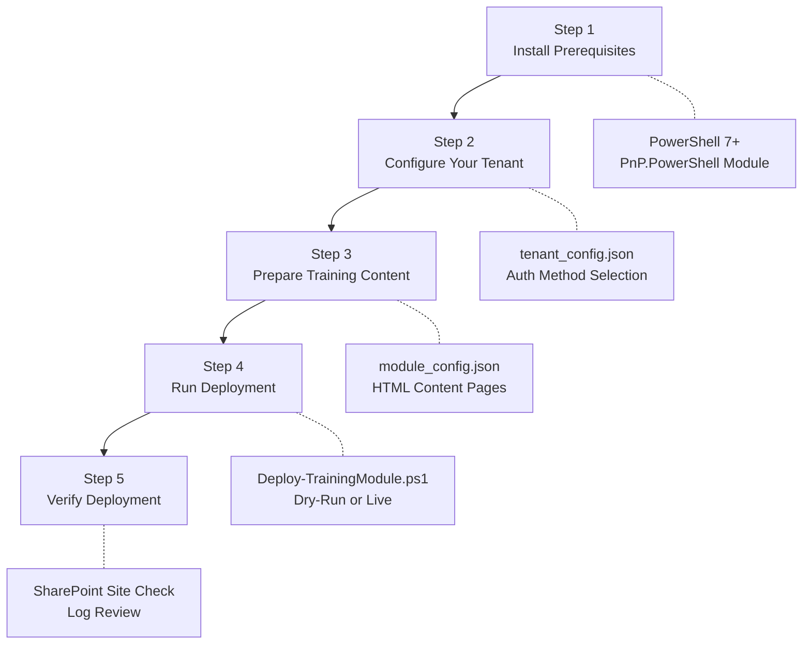

<![CDATA[# ⚡ Quick Start Guide

**SharePoint Training Deployer v1.0.0** · June 2026

Go from zero to a fully deployed SharePoint training module in five steps. This guide assumes you have a SharePoint Online site ready and administrative access to your Microsoft 365 tenant.

---

## Deployment Flow



---

## Pre-Flight Checklist

Before you begin, verify that every item in this checklist is satisfied:

| # | Item | Required | How to Verify |
|---|------|----------|---------------|
| 1 | Windows 10/11 operating system | ✅ Yes | `winver` in Run dialog |
| 2 | PowerShell 7.2 or later installed | ✅ Yes | `pwsh --version` in terminal |
| 3 | PnP.PowerShell module installed | ✅ Yes | `Get-Module PnP.PowerShell -ListAvailable` |
| 4 | Microsoft 365 account with SharePoint license | ✅ Yes | Check Microsoft 365 admin center |
| 5 | SharePoint site created for training content | ✅ Yes | Navigate to site URL in browser |
| 6 | Site Collection Admin or Site Owner permissions | ✅ Yes | Site Settings → Site Permissions |
| 7 | Outbound HTTPS (port 443) allowed | ✅ Yes | `Test-NetConnection login.microsoftonline.com -Port 443` |
| 8 | Training content files present in `content/` directory | ✅ Yes | `ls content\scalestick_sop\content_pages\` |
| 9 | `tenant_config.json` created in `config/` | ✅ Yes | `cat config\tenant_config.json` |
| 10 | Node.js 18+ (only if building interactive apps) | ⚪ Optional | `node --version` |

---

## Step 1: Install Prerequisites

### Install PowerShell 7

If you don't already have PowerShell 7 installed, choose one of these methods:

**Option A: winget (recommended)**
```powershell
winget install --id Microsoft.Powershell --source winget
```

**Option B: Microsoft Store**
Search for "PowerShell" in the Microsoft Store and install the latest version.

**Option C: MSI Installer**
Download the `.msi` installer from [PowerShell GitHub Releases](https://github.com/PowerShell/PowerShell/releases) and run it.

After installation, open a new terminal and verify:

```powershell
pwsh --version
# Expected output: PowerShell 7.4.x (or later)
```

### Install PnP PowerShell

Open PowerShell 7 (`pwsh`) and run:

```powershell
Install-Module PnP.PowerShell -Scope CurrentUser -Force -AllowClobber
```

Verify the installation:

```powershell
Get-Module PnP.PowerShell -ListAvailable
# Expected: Version 2.4.0 or later
```

> [!NOTE]
> If you're behind a corporate proxy, you may need to configure proxy settings before installing modules. See the [Admin Guide](docs/ADMIN_GUIDE.md#7-network--firewall-configuration) for proxy configuration instructions.

### Install Node.js (Optional)

Only required if you plan to build or modify interactive web applications embedded in training modules.

```powershell
winget install --id OpenJS.NodeJS.LTS --source winget
node --version
# Expected: v18.x.x or later
```

---

## Step 2: Configure Your Tenant

Create the tenant configuration file that tells the deployer where and how to connect.

### Create `config/tenant_config.json`

```json
{
  "tenantName": "contoso",
  "tenantUrl": "https://contoso.sharepoint.com",
  "siteUrl": "https://contoso.sharepoint.com/sites/Training",
  "authMethod": "interactive",
  "trainingLibraryName": "Training Modules",
  "defaultPageLayout": "Article",
  "enableLogging": true,
  "logRetentionDays": 90
}
```

### Finding Your SharePoint Site URL

1. Open your web browser and navigate to your SharePoint site.
2. The URL in the address bar is your `siteUrl`. It typically looks like:
   `https://yourcompany.sharepoint.com/sites/YourSiteName`
3. The `tenantUrl` is the root: `https://yourcompany.sharepoint.com`
4. The `tenantName` is the subdomain: `yourcompany`

### Choosing an Authentication Method

| Method | Best For | Config Value |
|--------|----------|-------------|
| **Interactive** | First-time setup, manual deployments, testing | `"interactive"` |
| **Certificate** | Production automated deployments, CI/CD pipelines | `"certificate"` |
| **Client Secret** | Development and testing environments only | `"clientsecret"` |

> [!TIP]
> Start with `"interactive"` authentication to validate your setup. You can switch to certificate-based authentication later for automated deployments. See the [Admin Guide](docs/ADMIN_GUIDE.md#5-authentication-options) for detailed instructions on each method.

---

## Step 3: Prepare Training Content

### Verify the Included Module

The package ships with the **ScaleStick SOP** module. Verify the content structure:

```powershell
# Check that the module directory and config exist
Test-Path "content\scalestick_sop"
Test-Path "content\scalestick_sop\module_config.json"
Test-Path "content\scalestick_sop\content_pages"
```

### Understand the Module Structure

Every training module follows this layout:

```
content/
└── module_name/
    ├── module_config.json        # Module metadata and page manifest
    ├── content_pages/            # HTML training pages
    │   ├── 01_introduction.html
    │   ├── 02_topic_name.html
    │   └── ...
    └── interactive_app/          # Optional: interactive exercises
        ├── index.html
        ├── style.css
        └── script.js
```

### Validate the Module

Run the validation script to check the module structure before deployment:

```powershell
.\scripts\Test-ModuleStructure.ps1 -ModuleName "scalestick_sop"
```

**Expected output:**

```
[PASS] Module directory exists: content\scalestick_sop
[PASS] module_config.json found and valid
[PASS] content_pages directory exists
[PASS] All referenced pages found (5 of 5)
[PASS] Page naming convention correct
[INFO] Interactive app: not enabled
✅ Module "scalestick_sop" is ready for deployment.
```

> [!IMPORTANT]
> If validation reports any `[FAIL]` items, resolve them before proceeding to Step 4. Common issues include missing HTML files referenced in `module_config.json` or incorrect file naming. See the [Trainer Guide](docs/TRAINER_GUIDE.md) for content creation instructions.

---

## Step 4: Run Deployment

### Dry-Run First (Recommended)

Always preview what will happen before making changes:

```powershell
.\scripts\Deploy-TrainingModule.ps1 `
    -ModuleName "scalestick_sop" `
    -ConfigPath ".\config\tenant_config.json" `
    -DryRun
```

Review the dry-run output carefully. You should see a list of pages that will be created, assets that will be uploaded, and navigation nodes that will be added.

### Live Deployment

When you're satisfied with the dry-run output, execute the real deployment:

```powershell
.\scripts\Deploy-TrainingModule.ps1 `
    -ModuleName "scalestick_sop" `
    -ConfigPath ".\config\tenant_config.json" `
    -Verbose
```

> [!WARNING]
> If using interactive authentication, a browser window will open for you to sign in. Make sure pop-ups are not blocked. You must sign in with an account that has **Site Owner** or **Site Collection Administrator** permissions on the target site.

### Expected Deployment Output

```
[INFO ] Connecting to https://contoso.sharepoint.com/sites/Training...
[AUTH ] Interactive login initiated. Please sign in via browser...
[OK   ] Connected successfully.
[INFO ] Loading module: scalestick_sop
[INFO ] Validating module structure...
[OK   ] Module validated. 5 pages, 1 interactive app.
[DEPLOY] Creating page 1/5: ScaleStick-SOP-Introduction...
[OK   ] Page created: ScaleStick-SOP-Introduction
[DEPLOY] Creating page 2/5: ScaleStick-SOP-Equipment-Setup...
[OK   ] Page created: ScaleStick-SOP-Equipment-Setup
[DEPLOY] Creating page 3/5: ScaleStick-SOP-Calibration...
[OK   ] Page created: ScaleStick-SOP-Calibration
[DEPLOY] Creating page 4/5: ScaleStick-SOP-Data-Recording...
[OK   ] Page created: ScaleStick-SOP-Data-Recording
[DEPLOY] Creating page 5/5: ScaleStick-SOP-Quality-Assurance...
[OK   ] Page created: ScaleStick-SOP-Quality-Assurance
[DEPLOY] Uploading interactive app assets (3 files)...
[OK   ] Assets uploaded to: Training Modules/scalestick_sop/interactive_app/
[DEPLOY] Configuring site navigation...
[OK   ] Navigation updated: 6 nodes added.
[INFO ] Deployment log saved: logs\deployment_20260628_143022.log
✅ Deployment complete. 5 pages created, 3 assets uploaded, 6 navigation nodes added.
```

---

## Step 5: Verify Deployment

### Post-Deployment Verification Checklist

| # | Verification Item | How to Check | Expected Result |
|---|-------------------|-------------|-----------------|
| 1 | Site pages visible | Navigate to `siteUrl/SitePages` in browser | All module pages appear in the page library |
| 2 | Content renders correctly | Click each page and review content | HTML content displays with proper formatting |
| 3 | Navigation works | Check site navigation menu | Training module appears with correct page hierarchy |
| 4 | Interactive app loads | Navigate to the interactive app page | App loads and functions correctly (buttons, inputs work) |
| 5 | Images display | Check all pages for broken image icons | All images render without broken links |
| 6 | Mobile responsive | Open site on mobile device or use browser dev tools | Pages render correctly on mobile viewports |
| 7 | Deployment log exists | Check `logs/` directory | Timestamped log file present with no `[ERROR]` entries |
| 8 | Permissions correct | Sign in as a standard employee account | Can view pages but cannot edit them |

### Check Deployment Logs

```powershell
# View the most recent deployment log
Get-ChildItem logs\ -Filter "deployment_*.log" | Sort-Object LastWriteTime -Descending | Select-Object -First 1 | Get-Content
```

Look for any `[ERROR]` or `[WARN]` entries. A clean deployment log should contain only `[INFO]`, `[OK]`, and `[DEPLOY]` entries.

### Rollback if Needed

If something went wrong, use the rollback script with the deployment log:

```powershell
.\scripts\Undo-TrainingDeployment.ps1 `
    -DeploymentLogPath ".\logs\deployment_20260628_143022.log" `
    -ConfigPath ".\config\tenant_config.json"
```

This will remove all pages, assets, and navigation nodes that were created during that specific deployment.

---

## Common First-Run Issues

| Issue | Likely Cause | Quick Fix |
|-------|-------------|-----------|
| `Connect-PnPOnline: The term is not recognized` | PnP.PowerShell not installed or not in current session | Run `Install-Module PnP.PowerShell -Scope CurrentUser -Force` |
| Browser doesn't open for login | Pop-up blocker or default browser issue | Try `-UseWebLogin` parameter or set default browser |
| `403 Forbidden` during deployment | Insufficient SharePoint permissions | Ensure your account has Site Owner role on the target site |
| `404 Not Found` for site URL | Incorrect `siteUrl` in tenant config | Verify the URL by navigating to it in a browser first |
| `module_config.json not found` | Module directory name mismatch | Ensure `-ModuleName` matches the folder name exactly (case-sensitive) |
| Deployment succeeds but pages are blank | HTML content pages are empty or malformed | Open HTML files in a browser locally to verify content before deploying |

> [!CAUTION]
> If you encounter persistent `429 Too Many Requests` errors, your deployment is being throttled by SharePoint Online. Wait 5–10 minutes before retrying. The deployer includes automatic retry logic with exponential backoff, but repeated rapid deployments during throttling can extend the cooldown period. See the [Troubleshooting Guide](docs/TROUBLESHOOTING.md) for detailed error resolution.

---

## Next Steps

- 📖 Read the [Trainer Guide](docs/TRAINER_GUIDE.md) to learn how to create new training modules.
- 🔧 Read the [Admin Guide](docs/ADMIN_GUIDE.md) for certificate authentication, scaling, and security hardening.
- 🐛 See the [Troubleshooting Guide](docs/TROUBLESHOOTING.md) if you encounter any issues.
- 📋 Return to the [README](README.md) for the full feature reference.

---

<p align="center">
  <strong>SharePoint Training Deployer v1.0.0</strong> · Quick Start Guide<br>
  Sovereign Biz Box · June 2026
</p>
]]>
