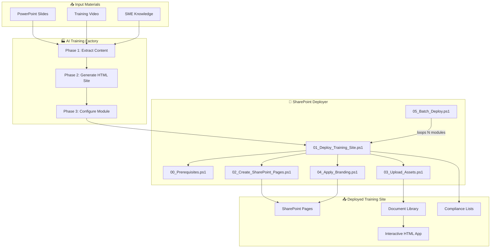

# 🏗️ SharePoint Training Site Deployer

**Automated deployment of interactive training sites to SharePoint Online — from PowerPoint to production in under 60 minutes.**

[](https://github.com/PowerShell/PowerShell)
[](https://www.microsoft.com/en-us/microsoft-365/sharepoint/collaboration)
[](https://pnp.github.io/powershell/)
[](#)
[](#)

---

## What This System Does

This is a **complete automation platform** that converts raw training materials (PowerPoint slides + demonstration video) into fully deployed SharePoint Online training sites — each with:

- ✅ **5 native SharePoint modern pages** (Home, Procedure Guide, Media, Assessment, Field Logs)
- ✅ **Interactive HTML training application** (glassmorphic dark-theme SPA with simulator, quiz, certificate)
- ✅ **Document libraries** with organized training assets
- ✅ **Compliance tracking lists** (Service Records + Training Completions)
- ✅ **Professional branding** (dark theme with cyan accents, custom navigation)
- ✅ **AI prompt playbook** for recreating the entire process for new modules

### Built for Scale

| Metric | Value |
|:-------|:------|
| Time per module | ~52 minutes |
| Modules per week | 2 (sustainable pace) |
| Modules per year | **100+** |
| Lines of automation code | 12,210 |
| Human intervention required | Content review + QA only |

---

## Architecture



---

## Quick Start (3 Commands)

### Prerequisites
- Windows 10/11 with PowerShell 7+
- SharePoint Online license (Microsoft 365 Business/Enterprise)
- Site Collection Administrator permissions

### Deploy Your First Training Site

```powershell
# 1. Install PnP PowerShell (one-time)
Install-Module PnP.PowerShell -Scope CurrentUser -Force

# 2. Edit your tenant URL
notepad .\config\deployment_config.json
# Change "tenantUrl" to: https://YOUR_COMPANY.sharepoint.com

# 3. Deploy the included ScaleStick SOP training site
.\scripts\01_Deploy_Training_Site.ps1 -ModuleName "scalestick_sop"
```

The script will:
1. Open a browser for SharePoint authentication
2. Create a Communication Site
3. Upload all training assets (18 slides + video + interactive app)
4. Build 5 native SharePoint pages with content
5. Apply professional branding and navigation
6. Output a direct link to your new training site

---

## Project Structure

```
sharepoint_training_deployer/
│
├── README.md                          ← You are here
├── AI_PROMPT_PLAYBOOK.md              ← AI prompts to create new modules
├── QUICKSTART.md                      ← 5-minute deployment guide
├── .gitignore
│
├── config/
│   ├── deployment_config.json         ← Tenant URL, theme, site settings
│   └── training_modules.csv           ← Batch deployment manifest
│
├── scripts/
│   ├── utils/
│   │   └── Deploy-Helpers.ps1         ← Shared functions (logging, config, reports)
│   ├── 00_Prerequisites.ps1           ← Environment validation
│   ├── 01_Deploy_Training_Site.ps1    ← Master orchestrator
│   ├── 02_Create_SharePoint_Pages.ps1 ← Native SharePoint page builder
│   ├── 03_Upload_Assets.ps1           ← Asset upload + list creation
│   ├── 04_Apply_Branding.ps1          ← Theme, navigation, logo
│   └── 05_Batch_Deploy.ps1            ← Deploy 100+ modules from CSV
│
├── templates/
│   ├── site_script.json               ← SharePoint Site Script (lists, columns)
│   ├── site_design.json               ← SharePoint Site Design registration
│   └── page_templates/
│       ├── home_page.json             ← Landing page layout
│       ├── procedure_page.json        ← Step-by-step procedure
│       ├── media_page.json            ← Slides + video gallery
│       └── assessment_page.json       ← Quiz + compliance checklist
│
├── content/
│   └── scalestick_sop/                ← Example: first training module
│       ├── module_config.json         ← Module metadata + content + quiz
│       └── interactive_app/           ← Complete HTML training application
│           ├── index.html             ← Glassmorphic interactive training site
│           └── assets/
│               ├── slides/            ← 18 slide PNGs
│               ├── procedure_video.mp4
│               ├── dashboard.png
│               └── favicon.svg
│
└── docs/
    ├── ADMIN_GUIDE.md                 ← IT admin: permissions, auth, security
    ├── TRAINER_GUIDE.md               ← Content creators: how to make modules
    ├── TROUBLESHOOTING.md             ← Error/solution reference
    └── AI_SCALE_BLUEPRINT.md          ← 5000-word AI automation blueprint
```

---

## How to Create a New Training Module

### The 7-Prompt AI Pipeline

For each new training module, run these 7 AI prompts in sequence. Full prompt text is in [AI_PROMPT_PLAYBOOK.md](AI_PROMPT_PLAYBOOK.md).

| Step | AI Prompt | Input | Output | Time |
|:-----|:----------|:------|:-------|:-----|
| 1 | Extract slides | `.pptx` file | `slides/slide_XX.png` + `slide_content.json` | 5 min |
| 2 | Download video | Video URL | `procedure_video.mp4` | 3 min |
| 3 | Generate HTML site | Slides + content + quiz | `index.html` (interactive training app) | 15 min |
| 4 | Create module config | Training content | `module_config.json` | 5 min |
| 5 | Set up content folder | All files | `content/[module]/` folder structure | 2 min |
| 6 | Deploy to SharePoint | Module name | Live SharePoint site | 5 min |
| 7 | QA verification | Site URL | Verification report | 15 min |

**Total: ~52 minutes per module. 100 modules = ~87 hours over a year.**

### Manual Process (Without AI)

See [docs/TRAINER_GUIDE.md](docs/TRAINER_GUIDE.md) for the complete manual process including:
- Extracting slides from PowerPoint manually
- Writing module_config.json from scratch
- Customizing the HTML template
- Running deployment scripts

---

## Batch Deployment (100+ Modules)

### 1. Add modules to the manifest

Edit `config/training_modules.csv`:

```csv
ModuleName,SiteUrlSuffix,Title,Description,ContentFolder,VideoSource,Owner,Category,Priority
scalestick_sop,training-scalestick-sop,SS-10 ScaleStick™ Maintenance,Cartridge replacement SOP,scalestick_sop,local,Training Eng,Water Treatment,High
boiler_maintenance,training-boiler-maint,Boiler Annual Maintenance,Annual boiler inspection SOP,boiler_maintenance,local,Training Eng,HVAC,High
fire_extinguisher,training-fire-ext,Fire Extinguisher Inspection,Monthly inspection checklist,fire_extinguisher,local,Safety Dept,Safety,Critical
```

### 2. Run batch deployment

```powershell
# Preview what will be deployed (no changes made)
.\scripts\05_Batch_Deploy.ps1 -DryRun

# Deploy all modules, continue on errors
.\scripts\05_Batch_Deploy.ps1 -ContinueOnError

# Deploy with delay between modules (avoids rate limiting)
.\scripts\05_Batch_Deploy.ps1 -ContinueOnError -DelayBetweenModules 15
```

### 3. Review the deployment report

After batch deployment, an HTML dashboard report is generated at `logs/batch_report_[timestamp].html` with per-module status.

---

## System Requirements

| Component | Minimum | Recommended |
|:----------|:--------|:------------|
| OS | Windows 10 (21H2) | Windows 11 (23H2+) |
| PowerShell | 7.2 | 7.4+ (`pwsh.exe`) |
| PnP.PowerShell | 2.4.0 | Latest |
| .NET Runtime | 6.0 | 8.0+ |
| SharePoint | Online (M365) | Current |
| Permissions | Full Control | Site Collection Admin |
| Browser | Edge or Chrome | Latest (for Interactive auth) |

---

## The Two-Tier Architecture

SharePoint Online blocks custom JavaScript on modern pages for security. This system uses a **two-tier architecture** to deliver both native SharePoint discoverability AND the full interactive training experience:

| Tier | What | Design Quality | How Users Access |
|:-----|:-----|:---------------|:-----------------|
| **Tier 1: SharePoint Pages** | 5 native modern pages with text, images, video | SharePoint standard (clean, professional) | Navigate directly in SharePoint |
| **Tier 2: Interactive App** | Full glassmorphic HTML app (simulator, quiz, certificate) | Premium dark-theme SPA (identical to local) | Click "Launch Interactive Training App" link |

The interactive HTML app runs in a new browser tab served from SharePoint's Document Library over HTTPS — rendering identically to the local development version.

---

## Documentation

| Document | Audience | Purpose |
|:---------|:---------|:--------|
| [README.md](README.md) | Everyone | Overview, quick start, architecture |
| [QUICKSTART.md](QUICKSTART.md) | Deployers | 5-step deployment checklist |
| [AI_PROMPT_PLAYBOOK.md](AI_PROMPT_PLAYBOOK.md) | AI operators | Copy-paste prompts for new modules |
| [ADMIN_GUIDE.md](docs/ADMIN_GUIDE.md) | IT Admins | Permissions, auth, security, scaling |
| [TRAINER_GUIDE.md](docs/TRAINER_GUIDE.md) | Content creators | How to create training content |
| [TROUBLESHOOTING.md](docs/TROUBLESHOOTING.md) | Everyone | Error/solution reference |
| [AI_SCALE_BLUEPRINT.md](docs/AI_SCALE_BLUEPRINT.md) | AI engineers | 5000-word automation blueprint |

---

## Example: Included Training Module

The repo includes one complete training module as a working reference:

**SS-10 ScaleStick™ Maintenance SOP**
- 18-slide training deck
- Procedure demonstration video
- Interactive HTML training app with:
  - Animated pressure gauge simulator
  - 4-phase procedure walkthrough
  - 5-question compliance quiz (100% pass required)
  - Printable completion certificate
  - Field service verification log
- Complete SharePoint deployment configuration

---

## FAQ

**Q: Can I use this without SharePoint?**
A: Yes. The interactive HTML training app (`content/[module]/interactive_app/index.html`) works standalone in any browser. SharePoint deployment is optional.

**Q: What if my organization uses Teams instead of SharePoint sites?**
A: Every SharePoint Communication Site can be linked as a Teams tab. Deploy the SharePoint site first, then add it to your Teams channel.

**Q: Can non-technical trainers create new modules?**
A: With the AI Prompt Playbook, yes. They provide the PowerPoint and video, run the 7 prompts, and the system handles the rest.

**Q: What about offline access?**
A: The HTML training app works offline once loaded. Slides and video are bundled locally. SharePoint pages require internet.

**Q: How do I update an existing training module?**
A: Re-run `01_Deploy_Training_Site.ps1` with the same module name. It will update existing pages and replace files.

---

## Version History

| Version | Date | Changes |
|:--------|:-----|:--------|
| 1.0.0 | June 2026 | Initial release — complete automation platform |

---

## License

Proprietary — SBB Training Engineering. Internal use only.

---

*Built with PnP PowerShell, modern web technologies, and AI-assisted automation.*
