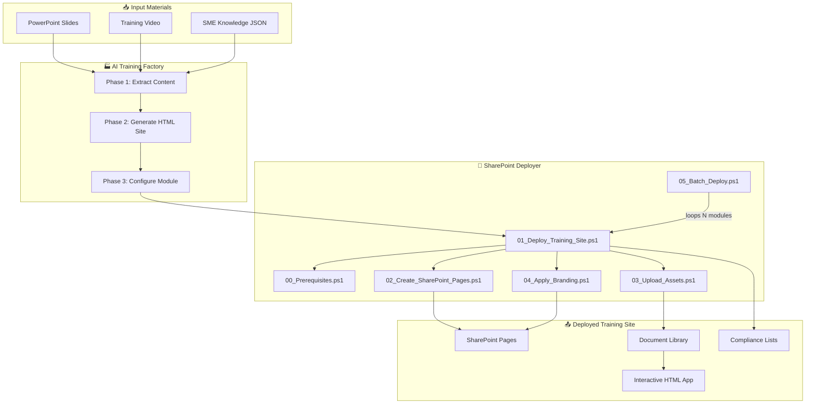

# 🏗️ SharePoint Training Site Deployer

**A Career-Grade, AI-Ready Enterprise Platform for Automated Deployment of High-Fidelity Training Modules and Interactive Glassmorphic SOP Applications to SharePoint Online.**

---

## 1. Executive Summary & System Vision

Modern enterprise standard operating procedures (SOPs) suffer from a critical medium gap. Passive documents (such as PDFs or static slide presentations) fail to guarantee knowledge absorption or compliance verification. Conversely, custom software training environments require massive development budgets and complex deployment overhead.

This platform bridges this gap by providing an automated **"Training Factory"** that takes raw training assets—a slide deck and a demonstration video—and automatically generates and provisions a complete training site on Microsoft SharePoint Online. 

### 1.1 The Dual-Tier Solution Architecture
To bypass the security sandbox limitations of modern SharePoint Online (which restricts custom scripting, external CSS, and arbitrary JavaScript on modern site pages), this platform uses a **Two-Tier Architecture**:

1. **Tier 1: Native SharePoint modern pages**: Built using standard SharePoint page sections, web parts, and navigation. This is what employees see when they land on the site. It handles discoverability, core text documentation, and video playback.
2. **Tier 2: High-fidelity interactive Single-Page Application (SPA)**: Serviced from the SharePoint Document Library. This is a premium, glassmorphic dark-theme application featuring a live interactive simulator, knowledge assessment quiz, and printable certificate generator. Because it runs in its own browser window under the site’s HTTPS domain, it retains 100% of its visual design quality, interactive state machine, and script-based verification engine.

This repository contains the complete codebase, configurations, and documentation required to deploy and maintain this infrastructure at scale. With this system, a single engineer or an automated AI agent can deploy **100+ training modules per year** with identical quality and complete consistency.

---

## 2. Core Technical Architecture & Data Flow



### 2.1 Technology Stack
- **Automation Framework**: PowerShell 7.2+ utilizing the `PnP.PowerShell` SDK module (Core cross-platform framework).
- **Hosting Environment**: SharePoint Online (Microsoft 365 Tenant).
- **Interactive App Stack**: Vanilla HTML5, CSS3 (Midnight Dark Theme, HSL Color Systems, Custom Glassmorphic Backdrop Filters), and ECMAScript 6 JavaScript.
- **Local Media Pipeline**: Custom Python scripts using `yt-dlp` and `python-pptx` for asset pre-processing.

### 2.2 Directory Structure

```
sharepoint_training_deployer/
│
├── README.md                          ← Main platform overview
├── AI_PROMPT_PLAYBOOK.md              ← Copy-paste AI prompts for scalability
├── QUICKSTART.md                      ← 5-minute deployment checklist
├── .gitignore
│
├── config/
│   ├── deployment_config.json         ← SharePoint tenant configurations & defaults
│   └── training_modules.csv           ← Manifest for bulk training site deployment
│
├── scripts/
│   ├── utils/
│   │   └── Deploy-Helpers.ps1         ← Common logging, reporting, config parsers
│   ├── 00_Prerequisites.ps1           ← Local environment and access validation
│   ├── 01_Deploy_Training_Site.ps1    ← Master orchestrator for single-site deploy
│   ├── 02_Create_SharePoint_Pages.ps1 ← Page building and native web part injector
│   ├── 03_Upload_Assets.ps1           ← Document library uploader & list creator
│   ├── 04_Apply_Branding.ps1          ← Branding theme, logo, and navigation setup
│   └── 05_Batch_Deploy.ps1            ← Bulk module runner for 100s of sites
│
├── templates/
│   ├── site_script.json               ← Lists and columns schema for site script
│   ├── site_design.json               ← SharePoint Site Design registration wrapper
│   └── page_templates/
│       ├── home_page.json             ← Structure for the module home page
│       ├── procedure_page.json        ← Layout for step-by-step guides
│       ├── media_page.json            ← Layout for slides/video displays
│       └── assessment_page.json       ← Layout for native compliance pages
│
├── content/
│   └── scalestick_sop/                ← Included ScaleStick SOP training module
│       ├── module_config.json         ← Title, description, safety warnings, quiz JSON
│       └── interactive_app/           ← Self-contained HTML SPA assets
│           ├── index.html             ← The glassmorphic interactive web app
│           └── assets/
│               ├── slides/            ← Extracted PPTX slides (slide_01.png...)
│               ├── procedure_video.mp4 ← Demonstration video file
│               ├── dashboard.png      ← Video poster thumbnail image
│               └── favicon.svg        ← Training site favicon & logo
│
└── docs/
    ├── ADMIN_GUIDE.md                 ← Security, permissions, Entra ID setup
    ├── TRAINER_GUIDE.md               ← Content preparation and slide extraction guide
    ├── TROUBLESHOOTING.md             ← Common errors, causes, and solutions
    └── AI_SCALE_BLUEPRINT.md          ← 5000-word engineering blueprint for scaling
```

---

## 3. PowerShell Deployment Scripts: Technical Details

### 3.1 `utils/Deploy-Helpers.ps1`
This helper script is dot-sourced by all other scripts to provide a standardized utility layer. It manages configuration loading, validation, formatted console logging, and HTML report generation.

Key functions:
- **`Get-DeployConfig`**: Reads and parses `config/deployment_config.json`. Validates that the tenant URL is formatted correctly with `https://`.
- **`Write-DeployLog`**: Outputs timestamps and color-coded status levels (`INFO` in cyan, `SUCCESS` in green, `WARNING` in yellow, `ERROR` in red) to the terminal. Concurrently appends logs to a local log file in the `logs/` directory.
- **`Test-PnPConnection`**: Checks if an active SharePoint session is present. If missing, attempts connection using the credentials and tenant URL defined in the configuration.
- **`New-DeploymentReport`**: Generates an HTML report upon completion. This report provides administrative paths to pages, document libraries, and compliance lists for the deployed site.

### 3.2 `00_Prerequisites.ps1`
A health check script that verifies the host environment. This ensures that deployments run smoothly on Windows 11 without dependency errors.

Verifications:
1. **PowerShell Version**: Validates that the host is running PowerShell 7.2 or higher. Prevents execution on outdated Windows PowerShell 5.1.
2. **PnP.PowerShell Module**: Checks if the module is installed. If missing, prompts the user to install it via `-Scope CurrentUser` and logs the output.
3. **SharePoint Authentication**: Tests if the user can successfully authenticate to the target SharePoint tenant.
4. **Site Admin Permissions**: Verifies if the authenticated user has sufficient privileges to provision new sites, create lists, and upload files.
5. **Folder Integrity**: Confirms that all necessary templates, configurations, and source content folders are present.

### 3.3 `01_Deploy_Training_Site.ps1`
The master orchestrator script. It initiates the deployment process for a single training module.

Parameters:
- `-ModuleName`: The folder name of the target training module in the `content/` directory.
- `-TenantUrl` (Optional): Overrides the default tenant URL from `deployment_config.json`.
- `-SiteUrlSuffix` (Optional): Overrides the site path suffix (e.g., `sites/training-module-name`).

Workflow:
1. Validates the input module directory.
2. Connects to the SharePoint Online service.
3. Creates a new SharePoint Communication Site (or connects to an existing one if the site already exists).
4. Calls `03_Upload_Assets.ps1` to upload local assets and create target SharePoint lists.
5. Calls `02_Create_SharePoint_Pages.ps1` to generate all modern client-side pages and inject web parts.
6. Calls `04_Apply_Branding.ps1` to apply custom dark themes, logos, and site navigation.
7. Logs the results and opens the newly created site home page in the default web browser.

### 3.4 `02_Create_SharePoint_Pages.ps1`
This script constructs the 5 native SharePoint pages by reading templates from `templates/page_templates/` and substituting placeholders (e.g., `{{SITE_URL}}`, `{{MODULE_TITLE}}`) with values from the deployment configuration.

Page construction:
- **Home (`Home.aspx`)**: Uses a single-column layout. Adds a Hero Section featuring the module's banner image, an executive summary text web part, a Quick Links web part for easy site navigation, and a call-to-action button linking directly to the interactive app.
- **Procedure Guide (`Procedure-Guide.aspx`)**: Uses multi-section templates. Safety warnings are highlighted with a shaded background (Zone Emphasis). The remaining sections display step-by-step procedures, tool matrices, and slide images aligned to each phase.
- **Media & Resources (`Media-Resources.aspx`)**: Uses a two-column layout. The left column contains an image web part showing key slides. The right column embeds the `procedure_video.mp4` file using the native SharePoint **File and Media** web part.
- **Assessment (`Assessment.aspx`)**: Contains a text block outlining passing criteria (100% correct answers), a large button linked to the interactive quiz page (`index.html#quiz`), and a compliance checklist.
- **Field Logs (`Field-Logs.aspx`)**: Displays a **List web part** connected to the "Service Records" list. This allows team members to view completed field tasks directly on the page.

### 3.5 `03_Upload_Assets.ps1`
Manages file uploads to the SharePoint Site Assets and document libraries, and creates the backend compliance lists.

Key operations:
1. **Document Library Provisioning**: Verifies that the "Training Assets" document library exists. If missing, creates it.
2. **Directory Mapping**: Recreates the subfolders (`slides`, `video`, `app`) within the document library.
3. **Asset Upload**: Uploads slide images, video files, and the full interactive app folder structure using `Add-PnPFile`. Shows progress indicators in the terminal during the upload.
4. **Service Records List**: Creates a custom SharePoint List with columns: `TechnicianName` (Text), `ServiceDate` (DateTime), `Location` (Text), `CartridgeType` (Text), `PressureReading` (Number), `Notes` (Note), and `Status` (Choice: Pass, Fail, Pending Review).
5. **Training Completions List**: Creates a list for compliance logging with columns: `EmployeeName` (Text), `EmployeeID` (Text), `CompletionDate` (DateTime), `AssessmentScore` (Number), and `CertificationStatus` (Choice).

### 3.6 `04_Apply_Branding.ps1`
Applies visual styles and configures navigation settings to ensure site layout consistency.

Branding actions:
- **Theme Deployment**: Connects to the tenant's theme repository and registers the custom dark navy and cyan accent theme defined in `deployment_config.json`. Applies this theme to the target site.
- **Logo Configuration**: Uploads `favicon.svg` to the site assets library and sets it as the site icon and logo.
- **Site Header**: Configures the site header layout type to "ColorBlock" to apply the primary accent color to the top navigation bar.
- **Navigation Setup**: Clears default navigation nodes. Re-provisions the top menu bar with links to the 5 newly created pages: Home, Procedure Guide, Media & Resources, Assessment, and Field Logs.
- **Default Home Page**: Sets `Home.aspx` as the root path landing page for the site.

### 3.7 `05_Batch_Deploy.ps1`
The automation engine designed for bulk operations. It processes multiple sites in sequence without requiring manual intervention.

How it works:
1. Reads `config/training_modules.csv` line by line.
2. For each line, extracts parameters like `ModuleName`, `SiteUrlSuffix`, `Title`, `Description`, and `Owner`.
3. Invokes `01_Deploy_Training_Site.ps1` as a nested task using the extracted parameters.
4. Captures success or failure logs. If a site deployment fails, the script records the error and proceeds to the next module (when the `-ContinueOnError` switch is active).
5. Pauses for a configurable period (default: 10 seconds) between site creations to avoid hitting API rate limits on the SharePoint Online tenant.
6. Generates a master HTML dashboard report showing the deployment status of all sites.

---

## 4. The ScaleStick™ SOP Reference Module

The platform includes a complete, pre-configured training module: the **SS-10 ScaleStick™ Maintenance SOP** (`content/scalestick_sop/`). This module serves as a reference for building and formatting future training programs.

```
content/scalestick_sop/
├── module_config.json              ← SOP metadata, text sections, and quiz database
└── interactive_app/
    ├── index.html                  ← Glassmorphic training SPA
    └── assets/
        ├── slides/                 ← 18 high-resolution procedural slides
        ├── procedure_video.mp4     ← 5MB MP4 procedure walkthrough video
        ├── dashboard.png           ← Video poster image
        └── favicon.svg             ← SVG logo & browser favicon
```

### 4.1 The Maintenance Standard (SOP SS-10)
This training module covers the maintenance standard for the SS-10 ScaleStick™ scale inhibition filter. The filter is used to protect commercial equipment (boilers, steam tables, combi-ovens) from mineral scale build-up. The SOP requires a technician to safely isolate the housing, depressurize the system, extract the spent cartridge, verify the new O-ring gasket, insert the new cartridge in the correct flow direction, hand-tighten the housing, and recommission the system.

### 4.2 The Glassmorphic Interactive App (`index.html`)
The interactive app is a self-contained Single-Page Application (SPA) designed with a glassmorphic midnight-blue layout.

#### 4.2.1 Dial Gauge State Machine
The app features an animated dial pressure gauge that tracks the state of two valves in a vector SVG graphic:
- **Valve 1 (Main Inlet)**: Controls incoming water supply.
- **Valve 2 (Relief/Flush)**: Vents internal water and air pressure.

The gauge needle rotation and current pressure value (0–150 PSI) are calculated using a physics simulation loop:

```javascript
let currentPressure = 125;
let targetPressure = 125;
// Main Loop updates target pressure based on valve states:
// - Inlet OPEN, Relief CLOSED = Target 125 PSI (Charged)
// - Inlet CLOSED, Relief OPEN = Target 0 PSI (Safe)
// - Inlet OPEN (slowly), Relief CLOSED = Target 75 PSI (Operational)
```

#### 4.2.2 Interactive SOP Simulator
Trainees interact with a vector representation of the ScaleStick filter housing. The simulator enforces the safety and operational sequence of the SOP:
1. **Unlocking**: The trainee must stage all required tools and check the safety acknowledgment box to unlock the simulation.
2. **Phase 1 (Isolate)**: The trainee clicks to close the inlet valve and open the relief valve. They watch the pressure gauge drop from 125 PSI to 0 PSI.
3. **Phase 2 (Extract)**: The trainee clicks the filter housing to unscrew it, then pulls it down to extract the old cartridge.
4. **Phase 3 (Install & Verify)**: The trainee must correctly verify the orientation of the new cartridge. The app contains a check for **O-ring placement**. If the trainee attempts to insert the cartridge upside down (with the black O-ring facing down), the app displays a warning and blocks the simulation until the orientation is corrected to face UP.
5. **Phase 4 (Recommission)**: The trainee closes the relief valve and opens the inlet valve slowly. Bubbles appear in the housing, simulating the air purge process. The system pressure rises back to a safe range of 75 PSI, completing the simulation.

```
       [SVG Simulation Flow]
  +-------------------------------+
  | Stage Tools & Accept Safety   |
  +---------------+---------------+
                  |
                  v
  +---------------+---------------+
  | Phase 1: Valve 1 -> CLOSED    |
  |          Valve 2 -> OPEN      |
  |          Pressure -> 0 PSI    |
  +---------------+---------------+
                  |
                  v
  +---------------+---------------+
  | Phase 2: Unscrew Sump Housing |
  |          Extract Old Filter   |
  +---------------+---------------+
                  |
                  v
  +---------------+---------------+
  | Phase 3: Insert New Filter    |
  |          Verify O-Ring is UP  | <-- Error check: Blocks if DOWN
  |          Hand-Tighten Sump    |
  +---------------+---------------+
                  |
                  v
  +---------------+---------------+
  | Phase 4: Close Valve 2        |
  |          Open Valve 1 (1/4)   |
  |          Purge Air (Bubbles)  |
  |          Pressure -> 75 PSI   |
  +-------------------------------+
```

#### 4.2.3 Quiz Engine and Grading Logic
The assessment page contains 5 multiple-choice questions. 
- **Requirement**: A score of 100% (5/5) is required to pass.
- **Feedback**: Provides immediate explanations for both correct and incorrect answers.
- **Completion**: Once a trainee passes, the app displays a button to generate their certificate of completion.

#### 4.2.4 Certificate Generator & Print Styling
The certificate page dynamically renders the trainee's name, completion date, score, and a unique verification hash. The print styles (`@media print` rules in CSS) format the layout for printing:

```css
@media print {
    body * {
        visibility: hidden;
    }
    #certificate-print-view, #certificate-print-view * {
        visibility: visible;
    }
    #certificate-print-view {
        position: absolute;
        left: 0;
        top: 0;
        width: 100%;
        height: 100%;
        border: 4px double #000;
        padding: 40px;
        background: #fff;
    }
}
```

This print layout hides background gradients, scrollbars, and navigation elements, printing only a clean, high-resolution certificate page.

#### 4.2.5 Field Verification Logger
The application features a logging utility where technicians record completed maintenance events. The checklist verifies:
- [ ] Relief/flush valve is closed and secured.
- [ ] Main shut-off supply valve is fully open.
- [ ] External housing has been wiped dry.
- [ ] System has been inspected for leaks under operating pressure.

Once checked, the technician enters their initials and date of service. The record is committed to the local browser database (`localStorage`) and rendered in an interactive history table below the form.

---

## 5. Scale-Up Playbook: Deploying 100+ Sites a Year

This section details how to scale the platform to deploy hundreds of training sites annually. It provides standard configurations, formatting schemas, and AI prompts to automate the creation of new modules.

### 5.1 Step-by-Step AI Prompt Playbook
You can use these step-by-step prompts with your AI coding assistant to quickly generate new training modules.

#### Prompt 1: Extract PowerPoint Assets
> **System Prompt Context**: You are an AI asset extraction assistant.
>
> **Task**: "I have attached a PowerPoint file for a new training procedure: `[ATTACH_FILE.pptx]`. Please extract all 18 slide images as 1080p PNG files. Save them sequentially as `slide_01.png` to `slide_18.png` in an output folder called `slides/`. Next, extract the text contents of each slide and output them in a structured JSON file called `slide_content.json` containing the slide number, title, body bullet points, and speaker notes."

#### Prompt 2: Generate Glassmorphic HTML App
> **System Prompt Context**: You are an AI frontend engineer specializing in single-page applications.
>
> **Task**: "Create a self-contained, single-file HTML interactive training application (`index.html`) using vanilla HTML, CSS, and JS. Use the following specifications:
> - **Brand Theme**: Dark space background (`#030712`), transluscent panels with backdrop blur, cyan (`#00f0ff`) and royal blue (`#3b82f6`) accent glows.
> - **Components**:
>   1. **Header Navigation**: Sticky top navigation bar.
>   2. **Tool Staging Deck**: Interactive tool selection area that checks off required items.
>   3. **System Simulator**: An SVG schematic displaying the equipment (e.g., valves, pipes, housing). Write JavaScript to animate the system state based on user clicks.
>   4. **Slide Library**: A slideshow carousel that reads images from `./assets/slides/slide_XX.png`.
>   5. **Video Library**: An HTML5 video player pointing to `./assets/procedure_video.mp4`.
>   6. **Quiz Module**: A 5-question multiple-choice quiz. Require 100% correct answers to pass.
>   7. **Certificate Generator**: Generates a printable completion certificate. Include print-only CSS styles.
>   8. **Field Log Form**: Saves submitted compliance records to the local browser database (`localStorage`) and renders them in a history table.
> Use the extracted text from `slide_content.json` to populate the copy. Ensure all CSS and JS are embedded in the single `index.html` file."

#### Prompt 3: Generate SharePoint Configurations
> **System Prompt Context**: You are a SharePoint developer.
>
> **Task**: "Generate a `module_config.json` file for our SharePoint deployment script. Use the metadata, safety hazard rules, required tool names, phase steps, and quiz questions from the newly generated module. Ensure the structure matches the template format below:
> ```json
> {
>   "moduleName": "new_module_name",
>   "siteSettings": {
>     "title": "New System SOP Title",
>     "description": "Short description of the new procedure",
>     "siteUrlSuffix": "training-new-module",
>     "category": "Maintenance & Compliance"
>   },
>   "content": {
>     "executiveSummary": "Detailed summary...",
>     "safetyHazards": ["Hazard 1", "Hazard 2"],
>     "requiredTools": ["Tool 1", "Tool 2"],
>     "procedures": {
>       "phase1": { "title": "Phase 1 Title", "steps": ["Step 1", "Step 2"] }
>     },
>     "quizQuestions": [
>       { "q": "Question Text", "opts": ["Opt 1", "Opt 2"], "correct": 0, "exp": "Explanation..." }
>     ]
>   }
> }
> ```"

#### Prompt 4: Run Deployer Orchestrator
> **System Prompt Context**: You are an IT automation script executor.
>
> **Task**: "I have populated the `content/new_module` folder with the `module_config.json`, the `interactive_app/index.html` file, and its associated slide/video assets. Please execute the deployment script using PnP PowerShell:
> ```powershell
> .\scripts\01_Deploy_Training_Site.ps1 -ModuleName "new_module"
> ```
> Verify that the communication site is provisioned, files are uploaded to the document library, lists are created, pages are built with correct web parts, and branding is applied."

### 5.2 Module Configuration Schema
Each new module folder in the `content/` directory must contain a `module_config.json` file matching this schema:

```json
{
  "$schema": "http://json-schema.org/draft-07/schema#",
  "title": "TrainingModuleConfig",
  "type": "object",
  "properties": {
    "moduleName": { "type": "string" },
    "version": { "type": "string" },
    "created": { "type": "string", "format": "date" },
    "author": { "type": "string" },
    "siteSettings": {
      "type": "object",
      "properties": {
        "title": { "type": "string" },
        "description": { "type": "string" },
        "siteUrlSuffix": { "type": "string" },
        "category": { "type": "string" }
      },
      "required": ["title", "description", "siteUrlSuffix", "category"]
    },
    "content": {
      "type": "object",
      "properties": {
        "executiveSummary": { "type": "string" },
        "safetyHazards": { "type": "array", "items": { "type": "string" } },
        "requiredTools": { "type": "array", "items": { "type": "string" } },
        "procedures": {
          "type": "object",
          "properties": {
            "phase1": { "$ref": "#/definitions/procedurePhase" },
            "phase2": { "$ref": "#/definitions/procedurePhase" },
            "phase3": { "$ref": "#/definitions/procedurePhase" },
            "phase4": { "$ref": "#/definitions/procedurePhase" }
          },
          "required": ["phase1", "phase2", "phase3", "phase4"]
        },
        "quizQuestions": {
          "type": "array",
          "items": {
            "type": "object",
            "properties": {
              "question": { "type": "string" },
              "options": { "type": "array", "items": { "type": "string" }, "minItems": 4, "maxItems": 4 },
              "correctIndex": { "type": "integer", "minimum": 0, "maximum": 3 },
              "explanation": { "type": "string" }
            },
            "required": ["question", "options", "correctIndex", "explanation"]
          }
        }
      },
      "required": ["executiveSummary", "safetyHazards", "requiredTools", "procedures", "quizQuestions"]
    }
  },
  "required": ["moduleName", "version", "created", "author", "siteSettings", "content"],
  "definitions": {
    "procedurePhase": {
      "type": "object",
      "properties": {
        "title": { "type": "string" },
        "steps": { "type": "array", "items": { "type": "string" } }
      },
      "required": ["title", "steps"]
    }
  }
}
```

### 5.3 Page Template Configurations
Page configurations are stored as JSON files in `templates/page_templates/`. They define the default layouts, section options, and web parts for the deployed pages.

Example configuration for `home_page.json`:
```json
{
  "pageTemplate": "home_page",
  "fileName": "Home.aspx",
  "title": "{{MODULE_TITLE}}",
  "headerLayout": "ColorBlock",
  "headerImageUrl": "{{SITE_URL}}/Training Assets/{{MODULE_NAME}}/slides/slide_01.png",
  "sections": [
    {
      "order": 1,
      "template": "OneColumnFullWidth",
      "zoneEmphasis": 2,
      "webParts": [
        {
          "type": "text",
          "column": 1,
          "content": "<h2>Overview</h2><p>{{MODULE_DESCRIPTION}}</p>"
        }
      ]
    }
  ]
}
```

---

## 6. Enterprise Deployment & IT Administrator Guide

### 6.1 Authentication Options
The PnP PowerShell framework supports multiple authentication configurations to align with corporate security guidelines.

1. **Interactive Logon (`-Interactive`)**:
   - Usage: Good for testing or small-scale deployments.
   - Command: `Connect-PnPOnline -Url $siteUrl -Interactive`
   - Flow: Opens a browser window prompting for Microsoft 365 credentials. Supports Multi-Factor Authentication (MFA).

2. **Entra ID App Registration & Client Certificate (Unattended/AI Automation)**:
   - Usage: Required for headless automation or running batch scripts from CI/CD pipelines.
   - Flow: Generates a self-signed certificate and registers an app pool in Microsoft Entra ID.
   - Configuration command:
     ```powershell
     Register-PnPEntraIDApp -ApplicationName "SBBTrainingDeployer" -Tenant "yourcompany.onmicrosoft.com" -Out "C:\keys" -DeviceCode
     ```
   - Deployment connection:
     ```powershell
     Connect-PnPOnline -Url $siteUrl -ClientId "your-app-id" -Tenant "yourcompany.onmicrosoft.com" -Thumbprint "cert-thumbprint"
     ```

### 6.2 Permission Requirements
The deploying account must have the following permissions assigned:

| Scope | Minimum Permission | Reason |
|:------|:-------------------|:-------|
| SharePoint Tenant | Site Creator / Admin | Required to provision new site collections (`New-PnPSite`) |
| Site Collection | Site Collection Administrator (SCA) | Required to modify pages, upload files, apply branding, and update lists |
| Entra ID | Application.ReadWrite.All (Admin Consent) | Required only if setting up unattended certificate authentication |

### 6.3 Whitelisting & HTML Field Security
To display the interactive HTML app (`index.html`) within an iframe inside a native SharePoint page, you must configure the tenant's HTML Field Security settings.

Steps:
1. Navigate to **Site Settings** on the target site collection.
2. Select **HTML Field Security** under the Site Collection Administration menu.
3. Choose **Permit contributors to insert iframes from any domain**, or select **Permit contributors to insert iframes only from the following domains** and add your SharePoint tenant domain (e.g., `yourcompany.sharepoint.com`).
4. Click **OK** to apply changes.

---

## 7. Troubleshooting Reference Matrix

For a complete reference, see [docs/TROUBLESHOOTING.md](docs/TROUBLESHOOTING.md).

| Error Message / Code | Primary Cause | Immediate Solution |
|:---------------------|:--------------|:-------------------|
| `The term 'Connect-PnPOnline' is not recognized` | PnP.PowerShell module is missing. | Run `Install-Module PnP.PowerShell -Scope CurrentUser -Force` in PowerShell 7. |
| `Connect-PnPOnline: AADSTS50011: The redirect URI specified does not match` | Authentication application mismatch. | Reconnect using the `-Interactive` flag. |
| `Access denied. You do not have permission to perform this action.` | Deploying account lacks Site Collection Admin (SCA) rights. | Request temporary or permanent SCA permissions from the M365 administrator. |
| `A site with the URL already exists` | Target site URL is currently taken. | Specify a unique `-SiteUrlSuffix` or delete the existing site first. |
| `Add-PnPFile: File not found at path` | Local asset path mismatch. | Check the file paths in the `content/[module]/` directory. |
| `Embedding content from this website isn't allowed` | Tenant domain is missing from HTML Field Security. | Add the tenant domain to the HTML Field Security list in Site Settings. |
| Page appears blank after creation | Web parts were added but the page was not published. | Publish the page manually or run `Set-PnPPage -Identity "PageName.aspx" -Publish`. |
| `Rate limit exceeded` or `429 Too Many Requests` | Too many API calls sent in rapid succession. | Increase the delay value between site creations: `.\05_Batch_Deploy.ps1 -DelayBetweenModules 15`. |

---

## 8. Platform FAQ

### Q: Can I use this without SharePoint?
**A:** Yes. The interactive HTML training application (`content/[module]/interactive_app/index.html` or the repo root `index.html`) is completely self-contained. It uses standard HTML5, CSS3, and vanilla JavaScript with zero framework dependencies. You can open and run it locally in any web browser without an active network connection or SharePoint environment.

### Q: What if my organization uses Microsoft Teams instead of SharePoint sites?
**A:** Every SharePoint site collection can be integrated directly with Microsoft Teams. First, deploy the training site using this platform. Then, open your Teams channel, click the **+ (Add a Tab)** icon, select **SharePoint**, and choose the deployed training site or page. The training site will render inline within Teams.

### Q: Can non-technical trainers create new modules?
**A:** Yes. By following the [AI Prompt Playbook](AI_PROMPT_PLAYBOOK.md), a trainer with basic computer access can generate the required training assets. They simply need to provide the PowerPoint presentation and demonstration video, run the provided prompts to extract content and build the HTML app, update the CSV manifest, and run the master deployment script.

### Q: What about offline access?
**A:** The HTML training application is designed to be fully functional offline. All slide images, stylesheets, scripts, and video files are stored locally in the folder structure. Once a user loads the app, they do not need an active internet connection to run simulations, take the quiz, or generate completion certificates. The native SharePoint pages, however, require an active network connection.

### Q: How do I update an existing training module?
**A:** To update content on an existing site, modify the local assets and run the deployment script again:
```powershell
.\scripts\01_Deploy_Training_Site.ps1 -ModuleName "scalestick_sop"
```
The script will overwrite the old files in the document library, update the text blocks on your modern pages, and publish the new versions. Existing service records and training completions logs will be preserved.

### Q: How do I ensure design and quality consistency across 100+ training modules?
**A:** The platform ensures layout consistency through the following guardrails:
1. **JSON Page Templates**: All deployed pages are generated from static layouts in `templates/page_templates/`. This enforces identical grid structures, section weights, and web part placements.
2. **Global Branding Theme**: The typography, color palette, and header layouts are defined globally in `deployment_config.json` and applied automatically.
3. **Self-Contained App Design System**: The interactive app style tokens (e.g., color variables, border-radius, backdrop blur rules) are defined in a central CSS template block. These properties are copied into each new module.
4. **AI Quality Checklists**: The [AI Prompt Playbook](AI_PROMPT_PLAYBOOK.md) contains QA verification prompts to validate styling, responsiveness, print formats, and simulation logic before a site is marked as ready for production.

---

## 9. Version History & Credits

- **Version 1.0.0** (June 2026): Initial release. Includes page builder, asset uploader, branding theme scripts, the ScaleStick SOP reference module, and documentation.
- **Author**: SBB Training Engineering
- **Contact**: `support@blackfoxgamingstudio.onmicrosoft.com`
