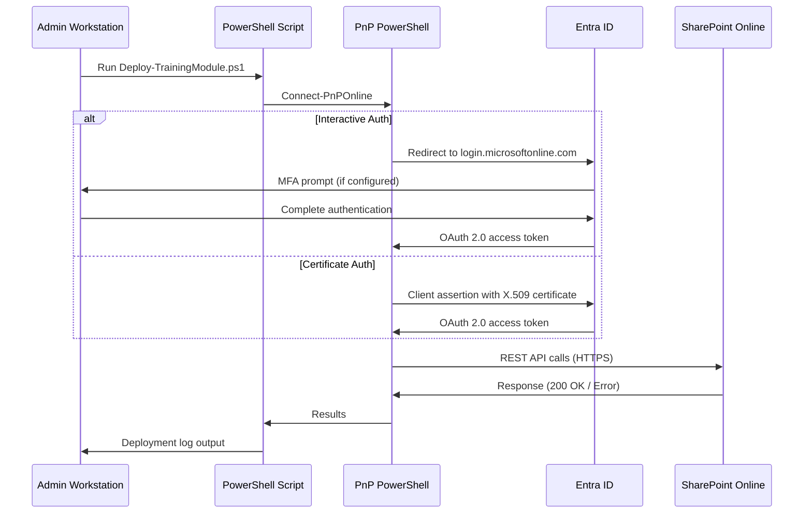
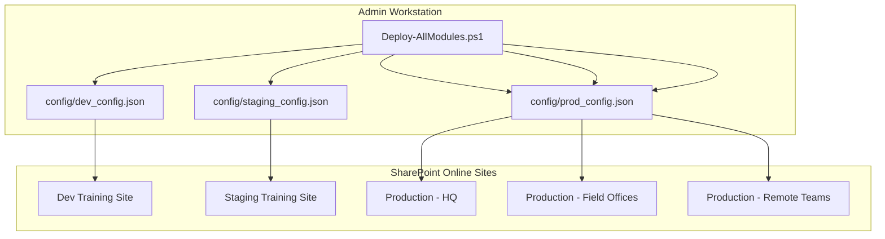

<
2. [Tenant Requirements](#2-tenant-requirements)
3. [Permissions Matrix](#3-permissions-matrix)
4. [PnP PowerShell Installation](#4-pnp-powershell-installation)
5. [Authentication Options](#5-authentication-options)
6. [Entra ID App Registration](#6-entra-id-app-registration)
7. [Network & Firewall Configuration](#7-network--firewall-configuration)
8. [Security Best Practices](#8-security-best-practices)
9. [Scaling Considerations](#9-scaling-considerations)
10. [Backup & Recovery](#10-backup--recovery)
11. [Monitoring & Maintenance](#11-monitoring--maintenance)

---

## 1. Overview & Scope

The SharePoint Training Deployer automates the creation and management of training content on SharePoint Online. From an administrator's perspective, the tool performs the following operations against your SharePoint environment:

- **Creates site pages** in the target site's SitePages library using the SharePoint REST API via PnP PowerShell.
- **Uploads files** (HTML, CSS, JavaScript, images) to document libraries for interactive training applications.
- **Modifies site navigation** by adding, updating, or removing navigation nodes to reflect the training module's page structure.
- **Reads site configuration** to validate permissions, detect existing pages, and avoid conflicts.

The tool does **not**:
- Modify site collection settings, site policies, or information management policies.
- Create or delete site collections or subsites.
- Modify user permissions or security groups.
- Access any data outside the specified target site URL.
- Install SharePoint Framework (SPFx) solutions or apps.

### Authentication Flow



---

## 2. Tenant Requirements

### Microsoft 365 Licensing

| License Type | SharePoint Included | Supported |
|-------------|-------------------|-----------|
| Microsoft 365 Business Basic | ✅ SharePoint Online (Plan 1) | ✅ Yes |
| Microsoft 365 Business Standard | ✅ SharePoint Online (Plan 1) | ✅ Yes |
| Microsoft 365 Business Premium | ✅ SharePoint Online (Plan 1) | ✅ Yes |
| Microsoft 365 E3 | ✅ SharePoint Online (Plan 2) | ✅ Yes |
| Microsoft 365 E5 | ✅ SharePoint Online (Plan 2) | ✅ Yes |
| Office 365 E1 | ✅ SharePoint Online (Plan 1) | ✅ Yes |
| SharePoint Online Plan 1 (standalone) | ✅ Yes | ✅ Yes |
| SharePoint Online Plan 2 (standalone) | ✅ Yes | ✅ Yes |
| SharePoint Server (on-premises) | ❌ N/A | ❌ Not Supported |

### PowerShell Execution Policy

The deployment scripts require an execution policy that permits running local scripts. Configure this on the admin workstation:

```powershell
# Check current policy
Get-ExecutionPolicy -List

# Set policy for current user (recommended)
Set-ExecutionPolicy -ExecutionPolicy RemoteSigned -Scope CurrentUser

# Or for the local machine (requires admin rights)
Set-ExecutionPolicy -ExecutionPolicy RemoteSigned -Scope LocalMachine
```

> [!IMPORTANT]
> The `RemoteSigned` policy allows locally created scripts to run while requiring downloaded scripts to be signed. Do **not** set the execution policy to `Unrestricted` in production environments.

### Additional Tenant Requirements

- **SharePoint modern experience** must be enabled (default for all new tenants).
- **Custom scripting** does not need to be enabled — PnP PowerShell uses the REST API, not CSOM scripting.
- **App catalog** is required only if deploying SPFx solutions (not used in v1.0.0).

---

## 3. Permissions Matrix

### Interactive Authentication (Delegated Permissions)

| Permission / Role | Scope | Required For | Minimum Role | Notes |
|-------------------|-------|-------------|--------------|-------|
| **Site Collection Administrator** | Target site collection | Full deployment capability | Site Collection Admin | Recommended for initial setup |
| **Site Owner** | Target site | Page creation, asset upload, navigation | Site Owner (Full Control) | Sufficient for routine deployments |
| **Site Member** | Target site | Read-only verification | Site Member (Edit) | Cannot deploy; can verify content |
| **Edit permission on SitePages** | SitePages library | Creating and updating site pages | Contribute or Edit | Library-level permission |
| **Edit permission on document library** | Training Modules library | Uploading interactive app assets | Contribute or Edit | Library-level permission |
| **Manage navigation** | Target site | Adding/removing navigation nodes | Site Owner (Design or Full Control) | Required for navigation setup |

### App-Only Authentication (Application Permissions)

| API Permission | Type | Required For | Admin Consent | Notes |
|---------------|------|-------------|---------------|-------|
| `Sites.ReadWrite.All` | Application | Creating pages and uploading files | ✅ Required | Grants read/write to all sites — scope with `Sites.Selected` if available |
| `Sites.Manage.All` | Application | Managing site navigation and settings | ✅ Required | Required for navigation node management |
| `Sites.Selected` | Application | Scoped access to specific sites only | ✅ Required | Preferred over `Sites.ReadWrite.All` — requires per-site grant |
| `User.Read` | Delegated | Reading current user profile (interactive only) | ❌ User consent | Used for logging deployment initiator |

> [!TIP]
> Use `Sites.Selected` permission whenever possible. This limits the app registration's access to only the specific SharePoint sites you explicitly authorize, following the principle of least privilege. After granting `Sites.Selected`, use the SharePoint admin center or Microsoft Graph to grant access to individual sites.

---

## 4. PnP PowerShell Installation

### Standard Installation

```powershell
# Open PowerShell 7 (pwsh)
# Install PnP.PowerShell from PSGallery
Install-Module PnP.PowerShell -Scope CurrentUser -Force -AllowClobber

# Verify installation
Get-Module PnP.PowerShell -ListAvailable

# Verify connectivity (quick test)
Connect-PnPOnline -Url "https://yourtenant.sharepoint.com" -Interactive
Disconnect-PnPOnline
```

### Update PnP PowerShell

```powershell
# Check current version
(Get-Module PnP.PowerShell -ListAvailable).Version

# Update to latest
Update-Module PnP.PowerShell -Force

# If update fails, remove and reinstall
Uninstall-Module PnP.PowerShell -AllVersions -Force
Install-Module PnP.PowerShell -Scope CurrentUser -Force
```

### Offline Installation (Air-Gapped Environments)

For environments without internet access:

```powershell
# On a connected machine: save the module to a folder
Save-Module PnP.PowerShell -Path "C:\OfflineModules"

# Transfer the C:\OfflineModules folder to the air-gapped machine via USB/network share

# On the air-gapped machine: install from the local path
$env:PSModulePath += ";C:\OfflineModules"
Import-Module PnP.PowerShell
```

> [!NOTE]
> When installing offline, you must also transfer all dependency modules. `Save-Module` downloads dependencies automatically. Ensure the entire `C:\OfflineModules` directory (including subdirectories) is transferred.

### Troubleshooting Module Installation

| Issue | Solution |
|-------|---------|
| `Install-Module: No match was found` | Ensure PSGallery is registered: `Register-PSRepository -Default` |
| `PackageManagement\Install-Package: cannot process argument` | Update PowerShellGet: `Install-Module PowerShellGet -Force` |
| Module loads but commands fail | Check .NET 6.0+ is installed: `dotnet --list-runtimes` |
| Version conflict with older PnP module | Remove all versions: `Uninstall-Module PnP.PowerShell -AllVersions` |

---

## 5. Authentication Options

### Option 1: Interactive Login (Recommended for Manual Deployments)

```powershell
# Simple interactive login — opens browser for sign-in
Connect-PnPOnline -Url "https://contoso.sharepoint.com/sites/Training" -Interactive
```

This method uses OAuth 2.0 authorization code flow with PKCE. The user signs in via browser, completes MFA if configured, and PnP receives a delegated access token. Best for manual, ad-hoc deployments.

### Option 2: App-Only with Certificate (Recommended for Production / CI/CD)

```powershell
# Certificate-based app-only authentication
Connect-PnPOnline `
    -Url "https://contoso.sharepoint.com/sites/Training" `
    -ClientId "a1b2c3d4-e5f6-7890-abcd-ef1234567890" `
    -Tenant "contoso.onmicrosoft.com" `
    -CertificatePath "C:\certs\deployer.pfx" `
    -CertificatePassword (ConvertTo-SecureString "YourCertPassword" -AsPlainText -Force)
```

This method uses the OAuth 2.0 client credentials flow with an X.509 certificate. No user interaction is required. The certificate is used to create a signed JWT assertion that proves the application's identity. Best for automated pipelines, scheduled deployments, and CI/CD systems.

### Option 3: App-Only with Client Secret (Development/Testing Only)

```powershell
# Client secret authentication — NOT recommended for production
Connect-PnPOnline `
    -Url "https://contoso.sharepoint.com/sites/Training" `
    -ClientId "a1b2c3d4-e5f6-7890-abcd-ef1234567890" `
    -ClientSecret "your-client-secret-value"
```

> [!CAUTION]
> Client secrets are transmitted over the wire (encrypted via TLS) and stored as plaintext strings. They are vulnerable to accidental exposure in logs, scripts, and version control. **Never use client secret authentication in production.** Use certificate authentication instead.

---

## 6. Entra ID App Registration

Follow these steps to create an Entra ID (formerly Azure AD) app registration for app-only authentication.

### Step 1: Navigate to Entra ID

1. Open the [Azure Portal](https://portal.azure.com) and sign in with a Global Administrator or Application Administrator account.
2. Navigate to **Microsoft Entra ID** → **App registrations** → **New registration**.

### Step 2: Register the Application

| Field | Value |
|-------|-------|
| **Name** | `SharePoint Training Deployer` |
| **Supported account types** | Accounts in this organizational directory only (Single tenant) |
| **Redirect URI** | Leave blank (not needed for app-only auth) |

Click **Register**.

### Step 3: Record Application IDs

After registration, note the following values from the **Overview** page:

- **Application (client) ID**: e.g., `a1b2c3d4-e5f6-7890-abcd-ef1234567890`
- **Directory (tenant) ID**: e.g., `d1e2f3a4-b5c6-7890-abcd-ef1234567890`

### Step 4: Configure API Permissions

1. Navigate to **API permissions** → **Add a permission**.
2. Select **Microsoft Graph** → **Application permissions**.
3. Add: `Sites.ReadWrite.All` and `Sites.Manage.All`.
4. Alternatively, add `Sites.Selected` for scoped access (recommended).
5. Click **Add permissions**.
6. Click **Grant admin consent for [Your Tenant]** and confirm.

### Step 5: Create a Certificate

Generate a self-signed certificate for authentication:

```powershell
# Generate a self-signed certificate (valid for 2 years)
$cert = New-SelfSignedCertificate `
    -Subject "CN=SharePoint Training Deployer" `
    -CertStoreLocation "Cert:\CurrentUser\My" `
    -KeyExportPolicy Exportable `
    -KeySpec Signature `
    -KeyLength 2048 `
    -NotAfter (Get-Date).AddYears(2)

# Export the public key (.cer) for upload to Entra ID
Export-Certificate -Cert $cert -FilePath "C:\certs\deployer.cer"

# Export the private key (.pfx) for use by PnP PowerShell
$password = ConvertTo-SecureString -String "YourCertPassword" -Force -AsPlainText
Export-PfxCertificate -Cert $cert -FilePath "C:\certs\deployer.pfx" -Password $password
```

### Step 6: Upload Certificate to Entra ID

1. In the app registration, navigate to **Certificates & secrets** → **Certificates** → **Upload certificate**.
2. Upload the `.cer` file generated in Step 5.
3. Verify the certificate thumbprint appears in the list.

### Step 7: Grant Site-Specific Access (If Using `Sites.Selected`)

If you used `Sites.Selected` instead of `Sites.ReadWrite.All`, grant the app access to specific sites:

```powershell
# Connect as a SharePoint Administrator
Connect-PnPOnline -Url "https://contoso-admin.sharepoint.com" -Interactive

# Grant the app read/write access to the training site
Grant-PnPAzureADAppSitePermission `
    -AppId "a1b2c3d4-e5f6-7890-abcd-ef1234567890" `
    -DisplayName "SharePoint Training Deployer" `
    -Site "https://contoso.sharepoint.com/sites/Training" `
    -Permissions Write
```

### Step 8: Configure `tenant_config.json`

Update your tenant configuration file with the app registration details:

```json
{
  "tenantName": "contoso",
  "tenantUrl": "https://contoso.sharepoint.com",
  "siteUrl": "https://contoso.sharepoint.com/sites/Training",
  "authMethod": "certificate",
  "clientId": "a1b2c3d4-e5f6-7890-abcd-ef1234567890",
  "tenantId": "d1e2f3a4-b5c6-7890-abcd-ef1234567890",
  "certificatePath": "C:\\certs\\deployer.pfx",
  "certificatePassword": "YourCertPassword",
  "trainingLibraryName": "Training Modules",
  "defaultPageLayout": "Article",
  "enableLogging": true
}
```

> [!WARNING]
> Do not commit `tenant_config.json` to version control when it contains a `certificatePassword`. Use environment variables or Azure Key Vault for secret management in production. See [Section 8: Security Best Practices](#8-security-best-practices).

---

## 7. Network & Firewall Configuration

### Required Outbound Endpoints

The following endpoints must be accessible from the admin workstation (outbound HTTPS over port 443):

| Endpoint | Port | Protocol | Purpose |
|----------|------|----------|---------|
| `login.microsoftonline.com` | 443 | HTTPS | Entra ID authentication and token issuance |
| `*.sharepoint.com` | 443 | HTTPS | SharePoint Online REST API and file upload |
| `graph.microsoft.com` | 443 | HTTPS | Microsoft Graph API (used by PnP PowerShell) |
| `accounts.accesscontrol.windows.net` | 443 | HTTPS | Azure Access Control Service (legacy auth) |
| `*.blob.core.windows.net` | 443 | HTTPS | Azure Blob Storage (large file uploads) |
| `*.cdn.office.net` | 443 | HTTPS | Office 365 CDN (page template assets) |
| `www.powershellgallery.com` | 443 | HTTPS | PowerShell module installation and updates |
| `dc.services.visualstudio.com` | 443 | HTTPS | PnP telemetry (optional — can be disabled) |
| `oneocsp.microsoft.com` | 443 | HTTPS | Certificate revocation checking |

### Proxy Configuration

If your network uses a proxy server, configure PnP PowerShell to use it:

```powershell
# Set proxy for the current PowerShell session
[System.Net.WebRequest]::DefaultWebProxy = New-Object System.Net.WebProxy("http://proxy.contoso.com:8080")
[System.Net.WebRequest]::DefaultWebProxy.Credentials = [System.Net.CredentialCache]::DefaultNetworkCredentials

# Alternatively, set environment variables (persistent)
$env:HTTP_PROXY = "http://proxy.contoso.com:8080"
$env:HTTPS_PROXY = "http://proxy.contoso.com:8080"
```

### Domain Whitelisting

For organizations using DNS-based filtering or web content filtering, whitelist the following domains:

- `*.microsoft.com`
- `*.microsoftonline.com`
- `*.sharepoint.com`
- `*.office.net`
- `*.windows.net`

---

## 8. Security Best Practices

> [!IMPORTANT]
> Security is not optional. The following practices should be implemented before any production deployment.

1. **Principle of Least Privilege**: Use `Sites.Selected` API permission instead of `Sites.ReadWrite.All`. Grant access only to the specific SharePoint sites where training content will be deployed. Revoke access when no longer needed.

2. **Certificate-Based Authentication Over Secrets**: Always use X.509 certificate authentication for app-only connections. Certificates are never transmitted over the wire — only a signed JWT assertion is sent. Client secrets are transmitted (encrypted via TLS) and are more vulnerable to exposure.

3. **Certificate Storage**: Store `.pfx` certificate files in a secure location with restricted filesystem permissions. In production, use Azure Key Vault or a hardware security module (HSM). Never store certificates in the project repository.

4. **Certificate Rotation**: Rotate certificates every 12 months. Set calendar reminders 30 days before expiration. Upload the new certificate to Entra ID and update `tenant_config.json` before the old certificate expires. Keep the old certificate active during the transition period.

5. **Separate Environment Configurations**: Maintain separate `tenant_config.json` files for development, staging, and production. Use different app registrations and certificates for each environment. Never use production credentials for testing.

6. **Secret Management**: Never hardcode passwords or secrets in scripts or configuration files committed to version control. Use:
   - Environment variables for CI/CD pipelines.
   - Azure Key Vault for enterprise secret management.
   - `SecureString` in PowerShell for interactive scenarios.

7. **Audit Logging**: Every deployment action is logged to `logs/deployment_YYYYMMDD_HHMMSS.log`. Retain these logs according to your organization's compliance requirements. Forward logs to your SIEM system if available.

8. **Version Control Security**: Add the following to `.gitignore`:
   ```
   config/tenant_config.json
   *.pfx
   *.cer
   *.pem
   logs/
   ```

9. **Access Review**: Periodically review who has access to the deployer workstation, the Entra ID app registration, and the target SharePoint sites. Remove access for personnel who no longer need it.

10. **Content Security Review**: All HTML content pages and interactive apps are deployed as-is to SharePoint. Implement a content review process to ensure no malicious JavaScript or external resource references are included before deployment.

---

## 9. Scaling Considerations

### Multi-Site Deployment Architecture



### Batch Deployment

For organizations with multiple training sites, create a batch deployment script:

```powershell
# Deploy to multiple sites in sequence
$sites = @(
    ".\config\site_hq.json",
    ".\config\site_field.json",
    ".\config\site_remote.json"
)

foreach ($config in $sites) {
    Write-Host "Deploying to: $config" -ForegroundColor Cyan
    .\scripts\Deploy-AllModules.ps1 -ConfigPath $config -Verbose
    Start-Sleep -Seconds 30  # Prevent throttling
}
```

### SharePoint API Throttling

SharePoint Online enforces API rate limits. Key thresholds:

| Limit | Threshold | Behavior |
|-------|-----------|----------|
| **Per-app limit** | ~600 requests per minute | `429 Too Many Requests` returned |
| **Per-user limit** | ~1,200 requests per minute | `429 Too Many Requests` returned |
| **Retry-After header** | 5–120 seconds | Wait period specified in response |
| **Daily limit** | ~50,000 API units per tenant | Varies by license and tenant size |

The deployer includes built-in retry logic with exponential backoff. However, for large deployments (50+ pages), consider:

- Deploying modules sequentially with a 30-second pause between modules.
- Scheduling deployments during off-peak hours (nights and weekends).
- Splitting very large modules into multiple smaller modules.

### Scheduled Deployments

#### Windows Task Scheduler

```powershell
# Create a scheduled task to deploy nightly at 2:00 AM
$action = New-ScheduledTaskAction `
    -Execute "pwsh.exe" `
    -Argument '-File "C:\Tools\sharepoint_training_deployer\scripts\Deploy-AllModules.ps1" -ConfigPath "C:\Tools\sharepoint_training_deployer\config\tenant_config.json"'

$trigger = New-ScheduledTaskTrigger -Daily -At 2:00AM

Register-ScheduledTask `
    -TaskName "SharePoint Training Deployer" `
    -Action $action `
    -Trigger $trigger `
    -Description "Automated nightly deployment of training modules" `
    -RunLevel Highest
```

#### Azure Automation

For cloud-based scheduling, use Azure Automation Runbooks with the PnP.PowerShell module installed in the Automation Account. This provides centralized logging, managed identity authentication, and webhook triggers.

---

## 10. Backup & Recovery

### Pre-Deployment Backup

Before deploying to a production site for the first time, document the current state:

```powershell
# Export current site pages list
Connect-PnPOnline -Url "https://contoso.sharepoint.com/sites/Training" -Interactive
Get-PnPListItem -List "SitePages" | Select-Object Id, @{N='Title';E={$_.FieldValues.Title}}, @{N='Modified';E={$_.FieldValues.Modified}} | Export-Csv "backup_pages_$(Get-Date -Format 'yyyyMMdd').csv"

# Export current navigation
Get-PnPNavigationNode -Location QuickLaunch | Export-Csv "backup_nav_$(Get-Date -Format 'yyyyMMdd').csv"
```

### SharePoint Recycle Bin Recovery

Pages deleted during a rollback go to the SharePoint Recycle Bin:

1. **First-stage Recycle Bin**: Items remain for 93 days. Accessible by site users via Site Contents → Recycle Bin.
2. **Second-stage Recycle Bin**: Items deleted from the first-stage bin remain for the balance of the 93-day period. Accessible by Site Collection Administrators.

```powershell
# Restore a page from the recycle bin
$recycledItem = Get-PnPRecycleBinItem | Where-Object { $_.Title -eq "ScaleStick-SOP-Introduction.aspx" }
Restore-PnPRecycleBinItem -Identity $recycledItem -Force
```

### Content Rollback Strategies

1. **Script-based rollback**: Use `Undo-TrainingDeployment.ps1` with the deployment log file. This removes created pages and navigation nodes in reverse order.
2. **Manual rollback**: Delete pages from SitePages library and remove navigation nodes through the SharePoint web UI.
3. **Version history**: SharePoint maintains version history for pages. If a page was updated (not created), use page version history to revert to the prior version.

---

## 11. Monitoring & Maintenance

### Log File Management

| Log Location | Content | Rotation |
|-------------|---------|----------|
| `logs/deployment_YYYYMMDD_HHMMSS.log` | Deployment actions, errors, warnings | Auto-purge after `logRetentionDays` (default: 90) |
| PowerShell transcript (if enabled) | Full console output | Manual management |

### Deployment Health Checks

After each deployment, run the following checks:

```powershell
# Check for errors in the latest deployment log
$latestLog = Get-ChildItem logs\ -Filter "deployment_*.log" | Sort-Object LastWriteTime -Descending | Select-Object -First 1
$errors = Select-String -Path $latestLog.FullName -Pattern "\[ERROR\]"
if ($errors) {
    Write-Host "⚠️ Deployment errors found:" -ForegroundColor Red
    $errors | ForEach-Object { Write-Host $_.Line }
} else {
    Write-Host "✅ No deployment errors found." -ForegroundColor Green
}
```

### Module Update Procedures

To update content in an already-deployed module:

1. Modify the HTML content pages or `module_config.json` in the local `content/` directory.
2. Increment the `version` field in `module_config.json`.
3. Re-run the deployment script. Existing pages will be updated; new pages will be created.
4. Verify the deployment via the post-deployment checklist.

### PnP PowerShell Update Schedule

| Frequency | Action |
|-----------|--------|
| Monthly | Check for PnP.PowerShell updates: `Find-Module PnP.PowerShell` |
| Quarterly | Update PnP.PowerShell: `Update-Module PnP.PowerShell -Force` |
| After updates | Run a test deployment against a staging site to verify compatibility |
| Annually | Review and rotate Entra ID certificates |

> [!NOTE]
> PnP PowerShell releases monthly updates that may include breaking changes. Always test against a non-production site after updating. Pin to a specific version in CI/CD pipelines using `Install-Module PnP.PowerShell -RequiredVersion 2.4.0`.

---

<p align="center">
  <strong>SharePoint Training Deployer v1.0.0</strong> · IT Administrator Guide<br>
  Sovereign Biz Box · June 2026
</p>
]]>
