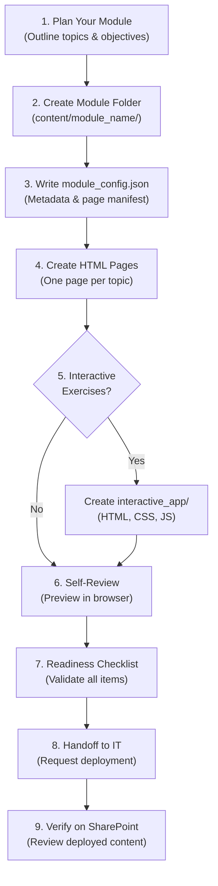

<![CDATA[# 🎓 Trainer & Content Creator Guide

**SharePoint Training Deployer v1.0.0** · June 2026

This guide is for trainers, subject matter experts (SMEs), instructional designers, and content creators who will be building training modules for deployment to SharePoint Online. **You do not need to install PowerShell or any development tools** — your IT team handles the deployment. Your job is to create excellent training content in a simple, structured format.

---

## Table of Contents

1. [Introduction](#1-introduction)
2. [Understanding Module Structure](#2-understanding-module-structure)
3. [Creating a New Training Module](#3-creating-a-new-training-module)
4. [Writing module_config.json](#4-writing-module_configjson)
5. [Creating HTML Content Pages](#5-creating-html-content-pages)
6. [Extracting Content from PowerPoint](#6-extracting-content-from-powerpoint)
7. [Adding Interactive Exercises](#7-adding-interactive-exercises)
8. [Content Best Practices](#8-content-best-practices)
9. [Module Readiness Checklist](#9-module-readiness-checklist)
10. [Handoff to IT](#10-handoff-to-it)

---

## 1. Introduction

### Who This Guide Is For

If you are a trainer, subject matter expert, or anyone who creates training content, this guide is for you. You know your subject area; the SharePoint Training Deployer handles the technology side of getting that content published to your organization's SharePoint site.

### What You Can Do

With this system, you can:

- **Create structured training modules** with multiple pages organized in a logical sequence.
- **Write content in HTML** — a simple format that any text editor can handle.
- **Include images, videos, and diagrams** to support your training material.
- **Build interactive exercises** like quizzes, simulations, and guided walkthroughs.
- **Update content easily** by editing files and requesting a redeployment.

### What You Don't Need

- ❌ No PowerShell knowledge required
- ❌ No SharePoint admin access required
- ❌ No coding experience required (for basic content pages)
- ✅ A text editor (VS Code, Notepad++, or even Notepad)
- ✅ A web browser (to preview your HTML pages locally)

---

## 2. Understanding Module Structure

Every training course is organized as a **module** — a self-contained folder with all the content for that course.

### Module Creation Workflow



### Directory Layout

```
content/
└── scalestick_sop/                    # Your module's folder (snake_case name)
    ├── module_config.json              # Module metadata and page order
    ├── content_pages/                  # Your HTML training pages
    │   ├── 01_introduction.html        # Page 1: Introduction
    │   ├── 02_equipment_setup.html     # Page 2: Equipment Setup
    │   ├── 03_calibration.html         # Page 3: Calibration Procedures
    │   ├── 04_data_recording.html      # Page 4: Data Recording
    │   └── 05_quality_assurance.html   # Page 5: Quality Assurance
    └── interactive_app/                # Optional: Interactive exercises
        ├── index.html                  # Main interactive page
        ├── style.css                   # Styling for the app
        └── script.js                   # Logic for the app
```

### File Naming Conventions

| Component | Convention | Example |
|-----------|-----------|---------|
| Module folder | `snake_case`, descriptive | `fire_safety_training` |
| Content pages | `##_topic_name.html` (zero-padded number prefix) | `01_introduction.html` |
| Config file | Always `module_config.json` | `module_config.json` |
| Images | `descriptive_name.png` or `.webp` | `calibration_diagram.png` |
| Interactive app entry | Always `index.html` | `index.html` |

> [!TIP]
> The numeric prefix on content pages (`01_`, `02_`, etc.) controls the display order. Use two-digit prefixes to support up to 99 pages per module. If you anticipate more, use three-digit prefixes (`001_`, `002_`).

---

## 3. Creating a New Training Module

Follow these seven steps to create a new training module from scratch.

### Step 1: Create the Module Folder

Navigate to the `content/` directory and create a new folder with a descriptive `snake_case` name:

```
content/
├── scalestick_sop/        ← Existing module
└── fire_safety_training/  ← Your new module
```

### Step 2: Create `module_config.json`

Inside your new module folder, create a file called `module_config.json`. This file tells the deployer everything about your module: its name, description, author, and the list of pages in order. See [Section 4](#4-writing-module_configjson) for the complete schema and example.

### Step 3: Create `content_pages/` Directory

Create a subfolder called `content_pages/` inside your module folder. All of your training page HTML files will go here.

### Step 4: Create Individual HTML Pages

Create one HTML file for each topic or lesson in your training course. Name them with a numeric prefix to control the order:

```
content_pages/
├── 01_introduction.html
├── 02_fire_hazards.html
├── 03_prevention_strategies.html
├── 04_evacuation_procedures.html
├── 05_extinguisher_use.html
└── 06_emergency_contacts.html
```

See [Section 5](#5-creating-html-content-pages) for HTML templates and formatting guidelines.

### Step 5: Create Interactive Exercises (Optional)

If your module includes interactive exercises, quizzes, or simulations, create an `interactive_app/` folder inside your module directory. See [Section 7](#7-adding-interactive-exercises) for details.

### Step 6: Validate Your Module

Before handing off to IT, self-review your module:

1. Open each HTML file in your web browser to verify content renders correctly.
2. Check all image references point to files that exist.
3. Verify `module_config.json` lists every page in the correct order.
4. Run through the [Module Readiness Checklist](#9-module-readiness-checklist).

### Step 7: Hand Off to IT

Contact your IT administrator and let them know your module is ready for deployment. See [Section 10](#10-handoff-to-it) for what to communicate.

---

## 4. Writing module_config.json

The `module_config.json` file is the blueprint for your training module. It tells the deployer what your module is called, who it's for, and which pages to deploy in what order.

### Schema Reference

| Field | Type | Required | Description |
|-------|------|----------|-------------|
| `moduleId` | string | ✅ Yes | Unique identifier (must match folder name) |
| `moduleName` | string | ✅ Yes | Human-readable module title |
| `moduleDescription` | string | ✅ Yes | Brief description (1-2 sentences) |
| `version` | string | ✅ Yes | Semantic version (e.g., `"1.0.0"`) |
| `author` | string | ✅ Yes | Author name or department |
| `lastUpdated` | string | ✅ Yes | Date in `YYYY-MM-DD` format |
| `targetAudience` | string | ✅ Yes | Who should take this training |
| `estimatedDuration` | string | ✅ Yes | Expected completion time |
| `pages` | array | ✅ Yes | Ordered list of training pages |
| `pages[].pageId` | string | ✅ Yes | Unique page identifier (within module) |
| `pages[].title` | string | ✅ Yes | Page title displayed in SharePoint |
| `pages[].fileName` | string | ✅ Yes | HTML file name in `content_pages/` |
| `pages[].order` | integer | ✅ Yes | Display order (ascending) |
| `pages[].description` | string | ⬜ No | Brief page description |
| `interactiveApp` | object | ⬜ No | Interactive app configuration |
| `interactiveApp.enabled` | boolean | ⬜ No | Whether to deploy the interactive app |
| `interactiveApp.entryPoint` | string | ⬜ No | Main file name (usually `"index.html"`) |
| `assessments` | object | ⬜ No | Quiz/assessment configuration |
| `assessments.enabled` | boolean | ⬜ No | Whether the module includes assessments |
| `assessments.passingScore` | integer | ⬜ No | Minimum score to pass (percentage) |
| `assessments.maxAttempts` | integer | ⬜ No | Maximum retry attempts |

### Complete Example

```json
{
  "moduleId": "scalestick_sop",
  "moduleName": "ScaleStick Standard Operating Procedures",
  "moduleDescription": "Comprehensive training on ScaleStick fish weighing and measurement equipment, covering setup, calibration, data recording, and quality assurance procedures for fisheries field technicians.",
  "version": "1.0.0",
  "author": "Fisheries Operations Training Team",
  "lastUpdated": "2026-06-28",
  "targetAudience": "Field Technicians, Lab Assistants, Quality Assurance Staff",
  "estimatedDuration": "60 minutes",
  "pages": [
    {
      "pageId": "introduction",
      "title": "Introduction to ScaleStick Operations",
      "fileName": "01_introduction.html",
      "order": 1,
      "description": "Overview of the ScaleStick system, its purpose in fisheries data collection, and training objectives."
    },
    {
      "pageId": "equipment_setup",
      "title": "Equipment Setup and Assembly",
      "fileName": "02_equipment_setup.html",
      "order": 2,
      "description": "Step-by-step instructions for unpacking, assembling, and powering on the ScaleStick unit."
    },
    {
      "pageId": "calibration",
      "title": "Calibration Procedures",
      "fileName": "03_calibration.html",
      "order": 3,
      "description": "Daily calibration protocol using certified reference weights and zero-point adjustment."
    },
    {
      "pageId": "data_recording",
      "title": "Data Recording Workflow",
      "fileName": "04_data_recording.html",
      "order": 4,
      "description": "How to record weight measurements, species codes, and sample metadata in the field data system."
    },
    {
      "pageId": "quality_assurance",
      "title": "Quality Assurance and Troubleshooting",
      "fileName": "05_quality_assurance.html",
      "order": 5,
      "description": "QA checks, common error codes, equipment maintenance, and when to escalate to the calibration lab."
    }
  ],
  "interactiveApp": {
    "enabled": true,
    "entryPoint": "index.html"
  },
  "assessments": {
    "enabled": true,
    "passingScore": 80,
    "maxAttempts": 3
  }
}
```

> [!IMPORTANT]
> The `moduleId` must exactly match the folder name. If your folder is `fire_safety_training`, then `moduleId` must be `"fire_safety_training"`. The `fileName` values must exactly match the file names in your `content_pages/` directory, including capitalization.

---

## 5. Creating HTML Content Pages

### Starter Template

Use this complete HTML template as a starting point for every training page. Copy it, rename the file using the `##_topic_name.html` convention, and replace the placeholder content:

```html
<!DOCTYPE html>
<html lang="en">
<head>
    <meta charset="UTF-8">
    <meta name="viewport" content="width=device-width, initial-scale=1.0">
    <title>Page Title — Module Name</title>
    <style>
        /* SharePoint-compatible base styles */
        body {
            font-family: "Segoe UI", -apple-system, BlinkMacSystemFont, sans-serif;
            line-height: 1.6;
            color: #323130;
            max-width: 900px;
            margin: 0 auto;
            padding: 20px;
        }
        h1 {
            color: #0078D4;
            font-size: 28px;
            border-bottom: 2px solid #0078D4;
            padding-bottom: 8px;
            margin-bottom: 24px;
        }
        h2 {
            color: #106EBE;
            font-size: 22px;
            margin-top: 32px;
        }
        h3 {
            color: #005A9E;
            font-size: 18px;
            margin-top: 24px;
        }
        .callout {
            background: #F3F2F1;
            border-left: 4px solid #0078D4;
            padding: 16px 20px;
            margin: 20px 0;
            border-radius: 4px;
        }
        .callout.warning {
            border-left-color: #D83B01;
            background: #FDF6F4;
        }
        .callout.success {
            border-left-color: #107C10;
            background: #F4FDF4;
        }
        img {
            max-width: 100%;
            height: auto;
            border: 1px solid #E1DFDD;
            border-radius: 4px;
            margin: 16px 0;
        }
        table {
            width: 100%;
            border-collapse: collapse;
            margin: 16px 0;
        }
        th, td {
            border: 1px solid #E1DFDD;
            padding: 10px 14px;
            text-align: left;
        }
        th {
            background: #F3F2F1;
            font-weight: 600;
        }
        ol, ul {
            padding-left: 24px;
        }
        li {
            margin-bottom: 8px;
        }
    </style>
</head>
<body>
    <h1>Page Title</h1>

    <h2>Learning Objectives</h2>
    <p>After completing this page, you will be able to:</p>
    <ul>
        <li>Objective 1 — describe what the learner will know or do.</li>
        <li>Objective 2 — describe the second outcome.</li>
        <li>Objective 3 — describe the third outcome.</li>
    </ul>

    <h2>Section Title</h2>
    <p>Your training content goes here. Write in clear, concise language appropriate for your target audience.</p>

    <div class="callout">
        <strong>Key Point:</strong> Highlight important information that learners should remember.
    </div>

    <h2>Step-by-Step Instructions</h2>
    <ol>
        <li><strong>Step 1:</strong> Description of the first step.</li>
        <li><strong>Step 2:</strong> Description of the second step.</li>
        <li><strong>Step 3:</strong> Description of the third step.</li>
    </ol>

    <h2>Reference Table</h2>
    <table>
        <thead>
            <tr>
                <th>Item</th>
                <th>Description</th>
                <th>Notes</th>
            </tr>
        </thead>
        <tbody>
            <tr>
                <td>Item A</td>
                <td>Description of Item A</td>
                <td>Additional notes</td>
            </tr>
            <tr>
                <td>Item B</td>
                <td>Description of Item B</td>
                <td>Additional notes</td>
            </tr>
        </tbody>
    </table>

    <div class="callout warning">
        <strong>Warning:</strong> Call out common mistakes or safety concerns here.
    </div>

    <h2>Knowledge Check</h2>
    <p>Before moving on, make sure you can answer these questions:</p>
    <ol>
        <li>Question about the material covered on this page?</li>
        <li>Another question to verify understanding?</li>
    </ol>
</body>
</html>
```

### Embedding Images

Place images in a subfolder within `content_pages/` and reference them with relative paths:

```html
<!-- Place images in content_pages/images/ -->

```

Recommended image formats:
- **WebP** (preferred): Best compression, supported by all modern browsers.
- **PNG**: For diagrams, screenshots, and images with text.
- **JPEG**: For photographs. Use quality 80–85 for good compression.

### Embedding Videos

Use `<iframe>` tags to embed videos from streaming services:

```html
<!-- Microsoft Stream -->
<iframe width="640" height="360"
    src="https://web.microsoftstream.com/embed/video/YOUR-VIDEO-ID"
    allowfullscreen style="border:none;">
</iframe>

<!-- YouTube -->
<iframe width="640" height="360"
    src="https://www.youtube.com/embed/YOUR-VIDEO-ID"
    allowfullscreen style="border:none;">
</iframe>
```

> [!NOTE]
> Do not upload large video files directly to SharePoint. Use a streaming platform (Microsoft Stream, YouTube, or Vimeo) and embed the player. This ensures smooth playback and avoids storage quota issues.

### Accessibility Requirements

All training content must meet basic accessibility standards:

- **Alt text**: Every `` must have a descriptive `alt` attribute.
- **Heading hierarchy**: Use `<h1>` → `<h2>` → `<h3>` in order. Do not skip levels.
- **Color contrast**: Ensure text has at least 4.5:1 contrast ratio against its background.
- **Link text**: Use descriptive link text, not "click here."
- **Table headers**: Use `<th>` elements for table column headers.

---

## 6. Extracting Content from PowerPoint

If you have existing training content in PowerPoint, follow these steps to convert it into HTML pages.

### Method 1: Export Slides as Images

1. Open your PowerPoint file.
2. Go to **File** → **Export** → **Change File Type** → **PNG** or **JPEG**.
3. Select **All Slides** and choose an output folder.
4. Each slide is saved as a numbered image (`Slide1.png`, `Slide2.png`, etc.).
5. Create an HTML page for each slide:

```html
<h1>Slide Title</h1>

<p>Speaker notes or additional explanation go here as text below the slide image.</p>
```

### Method 2: Save as HTML (then refine)

1. Open your PowerPoint file.
2. Go to **File** → **Save As** → select **Web Page (.htm, .html)** format.
3. PowerPoint generates an HTML file and a supporting files folder.
4. Open the generated HTML in a text editor and clean up the markup.
5. Copy relevant content sections into the HTML template provided in [Section 5](#5-creating-html-content-pages).

> [!TIP]
> Method 1 (slides as images) is faster but produces non-searchable content. Method 2 (HTML conversion) preserves text as searchable content but requires more cleanup. For best results, use a combination: extract images for diagrams and photos, and rewrite body text as HTML.

### Image Optimization

Optimize images before adding them to your module to reduce page load times:

| Format | Best For | Target File Size |
|--------|----------|-----------------|
| WebP | All web images | Under 200 KB |
| PNG | Diagrams with text, screenshots | Under 500 KB |
| JPEG (quality 80) | Photographs | Under 300 KB |

Free tools for image optimization: [Squoosh.app](https://squoosh.app) (web-based), Paint.NET (desktop).

---

## 7. Adding Interactive Exercises

### When to Use Interactive Apps

| Content Type | Use Static Pages | Use Interactive App |
|-------------|-----------------|-------------------|
| Text-based procedures | ✅ | |
| Diagrams and reference tables | ✅ | |
| Step-by-step walkthroughs | ✅ | |
| Multiple-choice quizzes | | ✅ |
| Equipment simulations | | ✅ |
| Drag-and-drop exercises | | ✅ |
| Scored assessments | | ✅ |

### Simple Quiz Example

Create `interactive_app/index.html` with this starter quiz code:

```html
<!DOCTYPE html>
<html lang="en">
<head>
    <meta charset="UTF-8">
    <meta name="viewport" content="width=device-width, initial-scale=1.0">
    <title>Module Assessment</title>
    <style>
        body {
            font-family: "Segoe UI", sans-serif;
            max-width: 700px;
            margin: 40px auto;
            padding: 20px;
            color: #323130;
        }
        .question {
            background: #F3F2F1;
            padding: 20px;
            border-radius: 8px;
            margin-bottom: 24px;
        }
        .question h3 { margin-top: 0; color: #0078D4; }
        .option {
            display: block;
            padding: 10px 16px;
            margin: 8px 0;
            background: white;
            border: 2px solid #E1DFDD;
            border-radius: 6px;
            cursor: pointer;
            transition: border-color 0.2s;
        }
        .option:hover { border-color: #0078D4; }
        .option.correct { border-color: #107C10; background: #F4FDF4; }
        .option.incorrect { border-color: #D83B01; background: #FDF6F4; }
        #results {
            padding: 24px;
            background: #EFF6FC;
            border-radius: 8px;
            text-align: center;
            display: none;
        }
        #results.pass { background: #F4FDF4; border: 2px solid #107C10; }
        #results.fail { background: #FDF6F4; border: 2px solid #D83B01; }
        button {
            background: #0078D4;
            color: white;
            border: none;
            padding: 12px 32px;
            border-radius: 6px;
            font-size: 16px;
            cursor: pointer;
            margin-top: 16px;
        }
        button:hover { background: #106EBE; }
    </style>
</head>
<body>
    <h1>Module Assessment</h1>
    <p>Answer the following questions to complete this training module. You need 80% or higher to pass.</p>

    <div class="question" data-correct="b">
        <h3>Question 1</h3>
        <p>How often should the ScaleStick be calibrated?</p>
        <div class="option" data-value="a">Once per month</div>
        <div class="option" data-value="b">At the start of each work day</div>
        <div class="option" data-value="c">Only when readings seem inaccurate</div>
        <div class="option" data-value="d">Once per year during annual maintenance</div>
    </div>

    <div class="question" data-correct="c">
        <h3>Question 2</h3>
        <p>What is the first step in the calibration procedure?</p>
        <div class="option" data-value="a">Place a fish on the scale</div>
        <div class="option" data-value="b">Record the current reading</div>
        <div class="option" data-value="c">Zero the scale with an empty tray</div>
        <div class="option" data-value="d">Check the battery level</div>
    </div>

    <button onclick="submitQuiz()">Submit Answers</button>

    <div id="results"></div>

    <script>
        function submitQuiz() {
            const questions = document.querySelectorAll('.question');
            let correct = 0;
            let total = questions.length;

            questions.forEach(q => {
                const correctAnswer = q.dataset.correct;
                const selected = q.querySelector('.option.selected');
                if (selected) {
                    if (selected.dataset.value === correctAnswer) {
                        selected.classList.add('correct');
                        correct++;
                    } else {
                        selected.classList.add('incorrect');
                        q.querySelector(`[data-value="${correctAnswer}"]`).classList.add('correct');
                    }
                }
            });

            const score = Math.round((correct / total) * 100);
            const results = document.getElementById('results');
            results.style.display = 'block';
            results.className = score >= 80 ? 'pass' : 'fail';
            results.innerHTML = `<h2>${score}%</h2><p>You got ${correct} out of ${total} correct.</p>` +
                (score >= 80 ? '<p><strong>✅ Congratulations! You passed.</strong></p>' :
                '<p><strong>❌ Please review the material and try again.</strong></p>');
        }

        document.querySelectorAll('.option').forEach(opt => {
            opt.addEventListener('click', function() {
                this.parentElement.querySelectorAll('.option').forEach(o => o.classList.remove('selected'));
                this.classList.add('selected');
            });
        });
    </script>
</body>
</html>
```

---

## 8. Content Best Practices

Follow these guidelines to create effective, engaging training content:

1. **One Concept Per Page**: Each HTML page should focus on a single topic or skill. If a page covers too many concepts, split it into multiple pages.

2. **Lead with Learning Objectives**: Start every page with 2–4 clear learning objectives so learners know what they're expected to understand.

3. **Use Progressive Disclosure**: Introduce concepts in a logical sequence. Don't reference procedures that haven't been explained yet.

4. **Include Knowledge Checks**: Add 1–2 review questions every 3–4 pages to reinforce learning and help learners self-assess.

5. **Chunk Content into 5–10 Minute Segments**: Each page should take a learner no more than 10 minutes to read and complete. This supports micro-learning patterns and prevents cognitive overload.

6. **Write for Your Audience's Reading Level**: Use plain language. Avoid jargon unless you define it. If your audience includes non-native English speakers, prefer shorter sentences and simpler vocabulary.

7. **Use Visuals Strategically**: Diagrams, annotated screenshots, and process flowcharts are more effective than paragraphs of text for procedural content. Every image must have descriptive alt text.

8. **Highlight Critical Information**: Use callout boxes (the `.callout` CSS class in the template) to draw attention to safety warnings, common mistakes, and key takeaways.

9. **Maintain Consistent Formatting**: Use the provided HTML template for every page. Consistent fonts, colors, heading styles, and spacing improve readability and look professional.

10. **Test on Mobile**: Many learners will access training on tablets or phones. Preview your pages at a 375px viewport width (mobile) and 768px (tablet) to ensure readability.

> [!CAUTION]
> Do not include external JavaScript libraries (jQuery, React, etc.) in your content pages. SharePoint Online's Content Security Policy may block them. Stick to inline styles and vanilla JavaScript for interactive elements.

---

## 9. Module Readiness Checklist

Before requesting deployment, verify every item in this checklist:

| # | Item | Required | Status |
|---|------|----------|--------|
| 1 | Module folder exists under `content/` with `snake_case` name | ✅ Required | ☐ |
| 2 | `module_config.json` is present and valid JSON | ✅ Required | ☐ |
| 3 | `moduleId` in config matches folder name exactly | ✅ Required | ☐ |
| 4 | All fields in `module_config.json` are populated | ✅ Required | ☐ |
| 5 | `content_pages/` directory exists | ✅ Required | ☐ |
| 6 | All HTML files listed in `pages[]` exist in `content_pages/` | ✅ Required | ☐ |
| 7 | Page files follow `##_topic_name.html` naming convention | ✅ Required | ☐ |
| 8 | `order` values in `pages[]` are sequential with no gaps | ✅ Required | ☐ |
| 9 | Every HTML page opens correctly in a web browser | ✅ Required | ☐ |
| 10 | All images display (no broken image icons) | ✅ Required | ☐ |
| 11 | All images have descriptive `alt` text | ✅ Required | ☐ |
| 12 | Headings follow proper hierarchy (h1 → h2 → h3) | ✅ Required | ☐ |
| 13 | No external JavaScript library references | ✅ Required | ☐ |
| 14 | Interactive app (if enabled) loads and functions correctly | ⬜ If applicable | ☐ |
| 15 | Content reviewed for accuracy by subject matter expert | ✅ Required | ☐ |
| 16 | Content reviewed for spelling and grammar | ✅ Required | ☐ |
| 17 | Images optimized (under 500 KB each) | ⬜ Recommended | ☐ |
| 18 | Pages render correctly at mobile viewport (375px width) | ⬜ Recommended | ☐ |
| 19 | Estimated duration in config matches actual completion time | ⬜ Recommended | ☐ |
| 20 | Version number incremented if updating existing module | ⬜ If applicable | ☐ |

---

## 10. Handoff to IT

When your module is ready, communicate the following to your IT administrator:

### What to Tell IT

1. **Module name and location**: "The `fire_safety_training` module is ready in `content/fire_safety_training/`."
2. **Target SharePoint site**: Which site should the module be deployed to?
3. **Target audience**: Who should have access to this training?
4. **Urgency**: Is there a deadline for deployment (e.g., compliance training due by end of quarter)?
5. **Testing**: Request deployment to a staging site first if one is available.

### Iteration Process

After IT deploys your module to a staging site:

1. **Review** every page on the SharePoint site.
2. **Test** navigation links, images, and interactive exercises.
3. **Note** any issues — formatting problems, broken images, missing pages.
4. **Communicate** changes to IT, update your local files, and request a redeployment.
5. **Approve** for production deployment once staging is verified.

> [!NOTE]
> Content updates are fast — IT can redeploy an updated module in minutes. Don't worry about getting everything perfect on the first try. The iteration cycle (edit locally → redeploy → review) is designed to be quick and painless.

---

<p align="center">
  <strong>SharePoint Training Deployer v1.0.0</strong> · Trainer & Content Creator Guide<br>
  Sovereign Biz Box · June 2026
</p>
]]>
